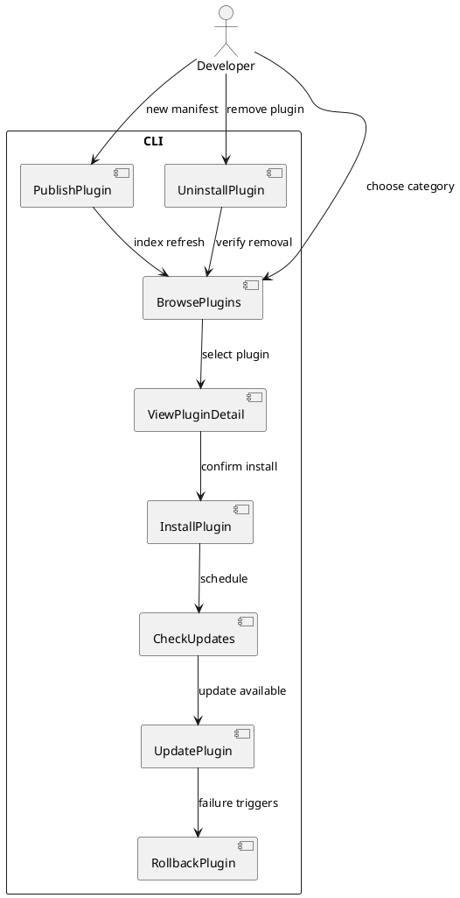

<!-- anchor: ui-ux-architecture-kinginyellow-plugin-marketplace -->
# UI/UX Architecture: KingInYellow Personal Plugin Marketplace
**Status:** UI_REQUIRED

<!-- anchor: 1-design-system-specification -->
## 1. Design System Specification
The CLI-first experience still benefits from a disciplined design system because ANSI-friendly colors, typography scaffolds for monospace terminals, and spacing tokens directly inform how `yargs` commands describe states, validations, and lifecycle scripts.

<!-- anchor: 1-1-color-palette -->
### 1.1 Color Palette
* **Primary (Solar Citrine `#F2C038`)**: Default accent for headings, success banners, and progress glyphs in terminals supporting 256 colors; mapped to ANSI 11 fallback so monochrome terminals still see a high-contrast yellow.
* **Secondary (Obsidian Violet `#3A1956`)**: Background tint for boxed summaries rendered via ASCII borders; doubles as PDF annotation color in docs.
* **Accent (Verdant Flux `#2FBF71`)**: Highlights completion states, cache health pings, and "trusted" confirmations; 16-color fallback uses ANSI green.
* **Info (Azure Relay `#4098D7`)**: Communicates changelog fetch statuses and telemetry instructions; integrates with structured JSON logs by tagging fields.
* **Warning (Amber Pulse `#F29D35`)**: Attaches to lifecycle script warnings, cache eviction notices, and feature flag toggles.
* **Danger (Signal Vermilion `#D64242`)**: For blocking errors such as `ERROR-INST-007`; reserved for irreversible actions.
* **Neutral Dark (Graphite `#1D1F21`)**: Base background assumption to ensure contrast checks meet WCAG 2.1 AA in terminals.
* **Neutral Mid (Slate `#4C566A`)**: Secondary text, metadata labels, and ASCII separators.
* **Neutral Light (Fog `#ECEFF4`)**: Inline code backgrounds within Markdown docs that echo CLI output samples.
* **Semantic Mapping Table:**
  | Tone | CLI Usage | Markdown Usage | Accessibility Notes |
  | --- | --- | --- | --- |
  | Primary | Command titles, focus indicators | Section headers | Maintain 4.5:1 contrast against Graphite |
  | Secondary | Panel borders, inactive steps | Pull-quote backgrounds | Use 2px letter spacing to avoid blur |
  | Accent | Success badges, `--yes` prompts | Success callouts | Provide textual labels, not color only |
  | Warning | Cache nearing limit, lifecycle caution | Warning admonitions | Pair with `WARNING` prefix |
  | Danger | Hard failures, policy violations | Critical callouts | Always include error codes |

<!-- anchor: 1-2-typography -->
### 1.2 Typography
* **Font Family Stack:** `"JetBrains Mono", "Fira Code", "SFMono-Regular", Menlo, Consolas, monospace` ensures ligature support but gracefully degrades.
* **Type Scale (relative to 16px base):**
  | Token | CLI Use | Docs Use | Weight |
  | --- | --- | --- | --- |
  | `display` (28px) | Rare celebratory banners after publish | Hero statements | 600 |
  | `h1` (24px) | Command sections in help output | H1 in docs | 600 |
  | `h2` (20px) | Subcommand examples | H2 | 500 |
  | `h3` (18px) | Step titles, flagged instructions | H3 | 500 |
  | `body-lg` (16px) | Default text | Body | 400 |
  | `body-sm` (14px) | Metadata, timestamps | Footnotes | 400 |
  | `mono-xs` (12px) | Inline JSON excerpts | Code captions | 400 |
* **Font Weights:** Use 600 for headings, 500 for interactive prompts, 400 for descriptive copy to reduce terminal flicker.
* **Line Length:** Cap to 72 characters per line in CLI to avoid wrapping; docs may extend to 90 where Markdown tables require.
* **Kerning Guidance:** Additional 0.05em letter spacing for uppercase warnings prevents blur in low-DPI terminals.

<!-- anchor: 1-3-spacing-and-sizing -->
### 1.3 Spacing & Sizing
* **Spacing Scale (unit = 4px equivalent even in text grid):** `0, 2, 4, 8, 12, 16, 20, 24, 32, 40, 48, 64`.
* **CLI Application:**
  * `2` = single space between inline tokens.
  * `4` = indentation for nested bullets.
  * `8` = gap between sections via blank lines.
  * `16` = ASCII boxes (top margin) to emphasize critical outputs.
* **Docs Application:** Use CSS variables `--space-1` … `--space-6` for consistent spacing in published HTML.
* **Component Density:** Installation progress bars allocate `32` units to house status + timer + note.
* **Iconography:** CLI uses ASCII icons (`✔`, `⚠`, `✖`) with `4` units padding; fallback to `[OK]` etc when Unicode unavailable.

<!-- anchor: 1-4-component-tokens -->
### 1.4 Component Tokens
* **Border Radius Tokens:** `radius-none (0)`, `radius-sm (2)`, `radius-md (4)`, `radius-lg (8)` even for docs diagrams; CLI boxes mimic via corner characters.
* **Shadow Tokens:** Represented textually: `shadow-sm` = `┆`, `shadow-md` = duplicate border offset to imply depth.
* **Transition Tokens:** CLI uses textual transitions (`...`) with spinner states. In docs, CSS durations: `fast 120ms`, `base 200ms`, `slow 300ms`.
* **Opacity Tokens:** `full`, `70`, `40`, `20` expressed via intensity of ASCII shading or Markdown emphasis, ensuring readability for high-contrast needs.
* **Animation Tokens:** ASCII spinner frames standardized to `['⠋','⠙','⠹','⠸','⠼','⠴','⠦','⠧','⠇','⠏']`; degrade to `-/|\` where necessary.

<!-- anchor: 1-5-voice-and-tone -->
### 1.5 Voice & Tone Guidelines
* **Voice:** Direct, toolsmith-like, uses second person to instruct (“Confirm the lifecycle script by typing `I TRUST THIS SCRIPT`." ).
* **Tone Levels:**
  * Informational = calm, uses emojis sparingly (`ℹ`).
  * Warning = urgent but respectful, always suggests remediation.
  * Error = authoritative, references specification anchors (e.g., `See SPEC 4.2`).
* **Microcopy:** Feature flags described as "experimental" with safe fallback text; prompts avoid yes/no bias.

<!-- anchor: 1-6-accessibility-design-system -->
### 1.6 Accessibility Considerations
* Provide textual synonyms for every color-coded state.
* Ensure screen readers (via `say` or `NVDA` in terminal capture) interpret progress by emitting `aria-live` style cues through timed log statements.
* Link each error message to documentation anchors using absolute Markdown references for compatibility with CLI help output.
* For docs, include skip-links (`[Skip to Commands]`) and maintain heading depth for assistive navigation.

<!-- anchor: 1-7-documentation-patterns -->
### 1.7 Documentation Patterns
* `docs/cli/*.md` mirrors CLI output examples to guarantee parity.
* Each command help block demonstrates flags, feature toggles, error states, and sample JSON logs.
* Provide admonition shortcodes for success, info, warning, error to reuse across docs and release notes.

<!-- anchor: 2-component-architecture -->
## 2. Component Architecture
CLI commands operate like pages; components describe recurring structures such as intro banners, confirmation prompts, compatibility tables, and audit logs.

<!-- anchor: 2-1-overview -->
### 2.1 Overview
* **Methodology:** Adapted Atomic Design for CLI: Atoms (tokens, icons, inline badges), Molecules (prompt groups), Organisms (command panels), Templates (command flows), Pages (actual CLI commands or docs pages).
* **Constraints:** Must adhere to layered architecture; CLI components only consume domain interfaces via typed adapters.
* **Internationalization:** Minimal, but tokens stored centrally to enable future localization.

<!-- anchor: 2-2-core-component-specification -->
### 2.2 Core Component Specification
#### Atoms
1. **AnsiHeading**: Props `{level, text, icon}`; enforces color palette mapping; accessible fallback to ASCII underlines.
2. **Badge**: Variants `success|info|warning|danger|flag`; includes label + icon; used inside summary tables.
3. **KeyValueRow**: Displays metadata pairs; ensures alignment using monospace grid; supports `copyable` state for commands.
4. **ProgressGlyph**: Spinner or percentage; includes `durationHint` for instrumentation.
5. **PromptText**: Multi-line descriptive copy with emphasis tokens; ensures lines ≤72 chars.
6. **InlineCode**: Wraps CLI examples; ensures contrast by adding background shading in docs.
7. **Divider**: ASCII `─` line with optional label; ensures 8-unit padding.
8. **ListCounter**: Pre-rendered numbers for multi-step instructions.
9. **FeatureFlagChip**: Shows flag name + default state; clickable in docs for definitions.
10. **AuditIcon**: Distinguishes telemetry vs. operations by icon shape.

#### Molecules
11. **CommandHeader**: Composition of AnsiHeading + Badge + FeatureFlagChip; states available commands and gating flags.
12. **ConfirmationPrompt**: PromptText + Input hint; enforces typed confirmations; includes `refDoc` link.
13. **LifecycleScriptPanel**: KeyValueRow list + InlineCode block showing script snippet with highlight.
14. **CompatibilityMatrix**: Table of OS/arch/Node/Claude compatibility verdicts; uses color-coded Badges but includes textual status.
15. **CacheStatusCard**: Badge + progress meter + recommendations; warns when >70% capacity.
16. **ErrorCallout**: Danger badge + code + remediation steps referencing spec sections.
17. **TelemetrySummary**: Table enumerating correlationId, transactionId, log path; ensures copyable commands.
18. **FlagToggleInfo**: Contextual explanation when user toggles flag; links to config file and CLI override precedence.
19. **ChangelogPreview**: Info box showing retrieved status and fallback message if unreachable.
20. **SandboxConsentBlock**: Displays lifecycle script digest, justification requirement, and prompt for `I TRUST THIS SCRIPT`.

#### Organisms
21. **InstallFlowPanel**: Aggregates CommandHeader, CompatibilityMatrix, LifecycleScriptPanel, CacheStatusCard, TelemetrySummary; orchestrates sequential output.
22. **UpdateFlowPanel**: Similar to install but emphasizes diff summary; includes inline changelog fetch results.
23. **RollbackFlowPanel**: Highlights transaction boundaries, cache hit/miss, and fallback instructions.
24. **PublishFlowPanel**: Adds SourceRepo info, Schema validation summary, and remote Git push preview.
25. **BrowseListingPanel**: Sorted plugin list with badges showing category, pins, deprecation state.
26. **SearchResultsPanel**: Accepts filters; includes ranking rationale per assumption 1.
27. **PluginDetailPanel**: Deep view with manifest data, permissions, scripts, compatibility verdict, install instructions.
28. **PinManagementPanel**: Shows pinned plugins with actions to adjust priority.
29. **ValidationReportPanel**: Summarizes schema validation outcomes, referencing CI equivalents.
30. **DiagnosticsPanel**: Surfaces environment preflight results, symlink tests, disk checks.
31. **HelpTemplate**: Document-style layout showing usage, options, examples, environment variables, exit codes.
32. **TelemetryExportPanel**: Guides user through `npm run metrics`, log file path, and anonymization steps.

#### Templates
33. **CommandTemplate**: Standard order: Header → Summary → Prereqs → Action Steps → Results → Next Steps.
34. **ConfirmationTemplate**: Multi-step instructions culminating in typed confirmation.
35. **ErrorTemplate**: Format for multi-error display referencing error codes.
36. **DocPageTemplate**: Markdown layout with anchors, code samples, diagrams, and cross-links.

#### Interaction Patterns
37. **StepwiseTimeline**: Visual numbering for 10-step uninstall journey; ensures user can resume mid-sequence.
38. **AtomicTransactionNarrative**: Narrates state transitions (staged, verified, committed) with textual diff.
39. **SecurityDisclosureBanner**: Precedes any lifecycle script display with security warning referencing CRIT-004.
40. **FeatureFlagDisclosure**: On command start, list toggles affecting behavior with default states.
41. **TelemetryOptInPrompt**: Summary of metrics captured and opt-out instructions referencing config precedence.

<!-- anchor: 2-3-component-hierarchy-diagram -->
### 2.3 Component Hierarchy Diagram (PlantUML)

```plantuml
@startuml
skinparam handwritten false
rectangle "CommandTemplate" {
  rectangle "CommandHeader" as CH
  rectangle "SummaryStack" as SS
  rectangle "ActionBlocks" as AB
  rectangle "OutcomePanel" as OP
}
CH --> "AnsiHeading"
CH --> "Badge"
CH --> "FeatureFlagChip"
SS --> "PromptText"
SS --> "KeyValueRow"
AB --> "CompatibilityMatrix"
AB --> "LifecycleScriptPanel"
AB --> "SandboxConsentBlock"
AB --> "ConfirmationPrompt"
OP --> "TelemetrySummary"
OP --> "ChangelogPreview"
OP --> "ErrorCallout"
rectangle "BrowsePage" {
  rectangle "BrowseListingPanel"
  rectangle "PluginDetailPanel"
  rectangle "PinManagementPanel"
}
rectangle "InstallFlow" {
  rectangle "InstallFlowPanel"
  rectangle "CacheStatusCard"
  rectangle "DiagnosticsPanel"
}
BrowseListingPanel --> Badge
PluginDetailPanel --> KeyValueRow
PinManagementPanel --> Badge
InstallFlowPanel --> CommandHeader
InstallFlowPanel --> CompatibilityMatrix
InstallFlowPanel --> LifecycleScriptPanel
InstallFlowPanel --> TelemetrySummary
@enduml
```

<!-- anchor: 2-4-component-behavior-contracts -->
### 2.4 Component Behavior Contracts
* Every component returns both `renderAnsi()` and `renderMarkdown()` ensuring parity between runtime CLI and docs.
* Input validation occurs before rendering; components accept typed `Result` objects and format them without side effects.
* Each component logs instrumentation (render time, data volume) to support performance profiling toggled via feature flag.

<!-- anchor: 2-5-accessibility-hooks -->
### 2.5 Accessibility Hooks within Components
* **CommandHeader** surfaces `aria-level` metadata translated to screen-reader friendly prefix text.
* **ConfirmationPrompt** repeats typed instructions twice (intro + before awaiting input) for cognitive support.
* **ErrorCallout** includes explicit failure reason, remediation, doc link, and correlationId.
* **CompatibilityMatrix** describes verdict as "Allowed", "Warn", "Blocked" textual states plus color.

<!-- anchor: 3-application-structure-and-user-flows -->
## 3. Application Structure & User Flows

<!-- anchor: 3-1-route-definitions -->
### 3.1 Route Definitions (CLI Commands)
| Command | Description | Component Template | Feature Flags | Access Level |
| --- | --- | --- | --- | --- |
| `marketplace install <plugin>` | Performs compatibility checks + atomic install | InstallFlowPanel | `installFlowV1`, `lifecycleSandbox` | General |
| `marketplace update <plugin>` | Fetches changelog, updates plugin | UpdateFlowPanel | `updateFlowV1` | General |
| `marketplace rollback <plugin> --to <version>` | Reverts to cached version | RollbackFlowPanel | `rollbackFlowV1` | General |
| `marketplace browse [--category]` | Lists plugins grouped by category | BrowseListingPanel | `discoveryV1` | General |
| `marketplace search <query>` | Filtered search with ranking | SearchResultsPanel | `discoveryV1` | General |
| `marketplace info <plugin>` | Detailed manifest view | PluginDetailPanel | `infoPanelV1` | General |
| `marketplace publish <path>` | Validates & publishes plugin manifest | PublishFlowPanel | `publishFlowV1` | Maintainer |
| `marketplace pin <plugin>` | Manage pin order | PinManagementPanel | `pinningV1` | General |
| `marketplace check-updates` | Batch check for new versions | DiagnosticsPanel + UpdateFlowPanel summary | `updateFlowV1` | General |
| `marketplace uninstall <plugin>` | Executes lifecycle uninstall | RollbackFlowPanel | `uninstallFlowV1` | General |

<!-- anchor: 3-2-critical-user-journeys-diagram -->
### 3.2 Critical User Journeys (PlantUML)

<!-- anchor: 3-3-user-flow-narratives -->
### 3.3 User Flow Narratives
1. **Browse & Discovery Flow:**
   1. Developer runs `marketplace browse --category tooling`.
   2. `CommandHeader` surfaces feature flags and cache timestamp.
   3. `BrowseListingPanel` presents categories sorted per assumption 1 with deterministic ordering.
   4. Deprecated plugins display SecurityDisclosureBanner with remediation.
   5. Developer drills into plugin via `info` command, reusing PluginDetailPanel.
2. **Install Flow (10 steps aligning with spec):**
   1. CLI fetches manifest and displays CompatibilityMatrix.
   2. DiagnosticsPanel reports disk, symlink, cache preflight.
   3. LifecycleScriptPanel prints scripts with line numbers.
   4. SandboxConsentBlock demands typed confirmation with digest + justification check.
   5. InstallFlowPanel narrates transaction states (stage/cache/link) referencing CRIT-001.
   6. CacheStatusCard updates; evictions logged if threshold passed.
   7. TelemetrySummary outputs correlationId for audit.
   8. CLI prints success message with time delta ensuring ≤2 minutes.
   9. Post-install instructions highlight pinned status options.
   10. FeatureFlagDisclosure suggests toggles for experimental flows.
3. **Update Flow:**
   1. `marketplace update plugin` triggers CheckUpdates pipeline.
   2. ChangelogPreview attempts fetch with fallback statuses per CRIT-008.
   3. CompatibilityMatrix re-validates nodeMax and OS to prevent regressions.
   4. LifecycleScriptPanel shows diff between previous and new scripts; user re-confirms.
   5. UpdateFlowPanel logs atomic upgrade path and rollback reference commit.
   6. Telemetry logs contain before/after checksums for auditing.
4. **Rollback Flow:**
   1. Developer selects cached version using `--to` or interactive prompt.
   2. RollbackFlowPanel verifies cache presence; if missing, emits `ERROR-ROLLBACK-002` referencing cache limits.
   3. CompatibilityMatrix ensures rollback target is still compatible.
   4. Transaction narrative outlines removal of active symlink, restoration of cached artifact, validation.
   5. TelemetrySummary notes rollback success and reason.
5. **Publish Flow:**
   1. Maintainer runs `marketplace publish ./plugin`.
   2. ValidationReportPanel displays schema validation status using AJV results.
   3. SandboxConsentBlock appears if lifecycle scripts changed.
   4. CommandHeader lists Git remotes and ensures PAT/SSH assumption documented.
   5. Template displays Git commands to push manifest, referencing docs for PAT setup.
   6. TelemetrySummary logs publish transaction and version tags.
6. **Uninstall Flow:**
   1. Developer executes `marketplace uninstall plugin`.
   2. CLI warns about cache retention options (keeping last three versions).
   3. LifecycleScriptPanel surfaces uninstall scripts with justification.
   4. Atomic operations remove symlink, update registry, optionally purge cache (flag controlled).
   5. DiagnosticsPanel ensures symlink cleanup success; Telemetry logs finalize.

<!-- anchor: 3-4-help-system -->
### 3.4 Help System Strategy
* Each command auto-generates help docs from component metadata, ensuring anchors line up with specification references.
* CLI help uses color-coded sections, but fallback plain text is verified through snapshot tests.
* Provide `--json` flag for machine-readable help to integrate with IDE assistants.

<!-- anchor: 3-5-accessibility-flows -->
### 3.5 Accessibility Touchpoints in Flows
* Step enumerations always include textual connectors ("Step 4/10").
* Keyboard navigation is inherent in CLI; provide `--non-interactive` fallback when terminals have no stdin.
* For docs, ensure focus-visible outlines and skip-links.

<!-- anchor: 4-cross-cutting-concerns -->
## 4. Cross-Cutting Concerns

<!-- anchor: 4-1-state-management -->
### 4.1 State Management
* **Approach:** Lightweight observable store built on top of Node.js EventEmitter respecting foundation's CLI-domain boundaries; CLI mutates local session state, persistent state remains in domain layer (`InstalledPluginRegistry`).
* **Structure:**
  * `ui.session` = `{ currentCommand, flags, correlationId }`.
  * `ui.progress` = array of step descriptors for spinner updates.
  * `ui.telemetry` = pending log events to flush at command end.
* **Server vs Client State:** CLI view state ephemeral; domain state persisted via JSON registries. Use selectors to derive view-specific slices.
* **Error Handling:** All components subscribe to `Result` objects; no thrown errors; ensures deterministic rendering even during failure.

<!-- anchor: 4-2-responsive-design -->
### 4.2 Responsive Design (Terminal-First)
* **Breakpoints:**
  * `narrow` (<80 cols) = single-column layout, minimal tables.
  * `standard` (80-119 cols) = default; two-column summary + details.
  * `wide` (≥120 cols) = side-by-side panels for faster scanning.
* **Patterns:**
  * Tables auto-collapse into stacked KeyValueRows on narrow terminals.
  * ASCII boxes adjust width but always maintain left alignment for readability.
  * PlantUML diagrams rendered only in docs; CLI references file path.
* **Doc Responsiveness:** Use CSS grid to keep diagrams responsive and accessible.

<!-- anchor: 4-3-accessibility -->
### 4.3 Accessibility (WCAG 2.1 AA)
* **Semantic Output:** All CLI outputs mimic semantics via clear headings and alt text. Example: `ERROR [ERROR-INST-007]: Cache write failed. Remediation: ...`.
* **Keyboard Navigation:** CLI prompts always support default values and `--non-interactive` flag.
* **Screen Reader Cues:** Provide `speakable` log option replicating key events with timestamps.
* **Color Contrast:** Minimum 4.5:1 ensured by chosen palette; fallback textual states prevent reliance on color.
* **ARIA Equivalent:** In docs, use `<aria-live>` for progress when embedding CLI logs.

<!-- anchor: 4-4-performance -->
### 4.4 Performance & Optimization
* **Budgets:**
  * CLI install flows target TTI < 2 minutes per spec success criteria.
  * CLI update/publish flows aim for < 10 minutes.
  * Docs load budgets: <200KB critical CSS/JS.
* **Strategies:**
  * Lazy load large changelog content; show placeholder until fetch completes.
  * Cache CLI help generation results per session to avoid recomputing Markdown.
  * Use streaming updates for progress bars to keep user engaged.
  * Provide `--quiet` flag to reduce output when piping to log analyzers.

<!-- anchor: 4-5-backend-integration -->
### 4.5 Backend Integration
* **API Communication:** CLI interacts with git + filesystem; uses infrastructure adapters for HTTP (fetching changelog) with timeouts + retries.
* **Auth Handling:** Leverages developer's git credentials; prompts referencing assumption 2; no storage of secrets.
* **Error Management:** Each adapter returns typed results with error codes; CLI surfaces them via ErrorCallout.
* **Schema Validation:** AJV results include pointer to failing path; CLI maps to component tokens for readability.

<!-- anchor: 4-6-observability -->
### 4.6 Observability & Telemetry
* **Logging:** Structured JSON to stdout, human-readable to stderr; includes correlationId, command, pluginId.
* **Metrics:** `npm run metrics` renders Prometheus snapshot; CLI surfaces quick summaries via TelemetrySummary component.
* **Tracing:** CLI attaches traceId to each domain call and prints at end for cross-referencing.
* **User Control:** `--no-telemetry` flag documented; config precedence ensures CLI flag overrides env/file.

<!-- anchor: 4-7-security -->
### 4.7 Security UX
* Lifecycle scripts always preceded by security warning referencing CRIT-004.
* Require justification string in manifest; CLI fails fast if missing as per assumption 6.
* Display digest + signature details; encourage manual verification before trust.
* Provide instructions for running in `--dry-run` to inspect actions.

<!-- anchor: 4-8-feature-flags -->
### 4.8 Feature Flag Experience
* Flags enumerated at command start with description, default state, and override instruction (CLI flag, env, config precedence).
* FeatureFlagChip visually encodes states; `experimental` label appended when flag not GA.
* Provide doc anchors for each flag explanation, enabling Ops_Docs_Architect to maintain traceability.

<!-- anchor: 4-9-error-handling -->
### 4.9 Error Handling Presentation
* ErrorCallout includes: error code, summary, impacted stage, remediation, doc link.
* Multiple errors displayed sequentially with numbering to support 23 canonical scenarios.
* CLI exit codes align with severity: 0 success, 1 recoverable user error, 2 system failure.

<!-- anchor: 5-tooling-and-dependencies -->
## 5. Tooling & Dependencies

<!-- anchor: 5-1-core-dependencies -->
### 5.1 Core Dependencies
* **Framework:** Node.js 20 LTS, `yargs` for routing, `chalk` (or `kleur`) for ANSI styling abiding by palette.
* **Validation:** `ajv@8` for JSON schema; `ajv-formats` for additional checks.
* **Terminal UI Helpers:** `ora` for spinners (customized with spinner tokens), `cli-table3` for tables, `log-update` for streaming updates.
* **File Ops:** `zx`-style helper wrappers for git commands to maintain sandbox.
* **Config:** `dotenv`, custom config accessor aligning with Rulebook.

<!-- anchor: 5-2-development-tooling -->
### 5.2 Development Tooling
* **Package Manager:** `pnpm` with workspace scripts for CLI/domain/infra packages.
* **Type Checking:** `tsc --noEmit` with strict settings.
* **Linting:** ESLint (strict config) + markdownlint for docs.
* **Formatting:** Prettier for Markdown/docs with 80-char wrap to match CLI width.
* **Docs:** `typedoc` for API references; `doctoc` for TOC maintenance.

<!-- anchor: 5-3-testing-and-qa -->
### 5.3 Testing & QA Strategy
* **Unit Tests:** `vitest` for component renderers (ANSI + Markdown snapshots) ensuring consistent strings.
* **Integration Tests:** Simulate CLI commands in tmp git repos; verify component outputs align with spec (error codes, prompts).
* **Accessibility Tests:** Automated contrast tests for docs via `pa11y`; manual verification for CLI transcripts.
* **Performance Tests:** Measure install/update flows under network throttling to ensure budgets.
* **CI Hooks:** `.github/workflows/validate-schemas.yml` runs lint + schema validation + tests under one minute for validation stage.

<!-- anchor: 5-4-documentation-tooling -->
### 5.4 Documentation & Diagram Tooling
* PlantUML diagrams stored under `docs/diagrams/uiux/`; CLI references file paths.
* Mermaid optional for docs, but PlantUML mandated for architecture deliverables.
* Provide snippet library for anchors to maintain consistency.
* Use `doctoc` to inject anchor-aware TOCs without breaking manual anchors.

<!-- anchor: 5-5-governance -->
### 5.5 Governance & Traceability Hooks
* Every UI component change references FR/NFR IDs in pull requests.
* `docs/traceability-matrix.md` gains entries linking UI concerns to requirements such as FR-004 (install) and FR-010 (publish).
* Audit log of CLI prompts stored to satisfy adversarial review requirements.

<!-- anchor: 5-6-future-evolution -->
### 5.6 Future Evolution Considerations
* Should graphical UI be approved later, reuse tokens and component contracts defined here to accelerate build.
* Telemetry data informs which commands need richer visualization; maintain instrumentation today to prevent guesswork.
* Feature flag infrastructure already CLI-visible, enabling progressive delivery for Phase 2 discovery features.

<!-- anchor: 6-cli-interaction-pattern-library -->
## 6. CLI Interaction Pattern Library
This section codifies nuanced behaviors developers experience repeatedly, ensuring UI/UX parity between the CLI runtime and associated Markdown documentation.

<!-- anchor: 6-1-progress-feedback -->
### 6.1 Progress & Feedback Patterns
* **Atomic Stage Broadcasts:** Every install/update/rollback flow emits `STAGE START` and `STAGE COMPLETE` messages, each prefixed with timestamps and correlationId.
* **Adaptive Spinner Selection:** Spinners automatically downgrade to ASCII when terminal reports limited charset; store detection result in session state.
* **Quiet Mode Messaging:** When `--quiet` active, only STAGE START/COMPLETE and errors display; docs illustrate toggling behavior so expectations stay aligned.
* **Long-Running Step Guidance:** Steps exceeding 10 seconds display contextual hints (e.g., "Fetching changelog... (timeout in 15s)") and recommended troubleshooting.
* **Success Ritual:** Always end with `✔ Completed in Xs (Transaction YYY)` plus next-step suggestions (pinning, running tests) to reinforce closure.

<!-- anchor: 6-2-input-patterns -->
### 6.2 Input & Confirmation Patterns
* **Yes/No Prompts:** Avoid single-key confirmations; require full words (`yes`, `no`) to prevent accidental key presses.
* **Typed Phrases:** Lifecycle confirmations demand typed sentence; CLI displays sample plus reason referencing CRIT-004.
* **Default Values:** Display `[default: value]` inline; pressing enter accepts; docs highlight overriding via flags.
* **Validation Feedback:** Invalid input echoes reason plus doc link; prompt reappears with previous entry preserved for editability.
* **Non-Interactive Mode:** For CI or scripts, `--non-interactive` converts prompts into env var lookups; errors reference missing env names.

<!-- anchor: 6-3-notification-patterns -->
### 6.3 Notification & Messaging Patterns
* **Inline Notifications:** Short-lived messages inserted under current step; avoid full screen re-render to reduce flicker.
* **Persistent Notifications:** For warnings requiring follow-up (e.g., cache near limit), message repeats at command end.
* **Documentation Tie-ins:** Each notification optionally includes `[View Guide]` linking to docs anchors maintained by Ops_Docs_Architect.
* **Batch Notifications:** `check-updates` collates multiple plugin advisories into grouped summaries sorted by severity.
* **Telemetry Notices:** On first run, CLI outlines telemetry policy; subsequent runs only remind when config changes.

<!-- anchor: 6-4-sample-session-blueprint -->
### 6.4 Sample Session Blueprint
1. Developer launches `marketplace install spectral-linter`.
2. CommandHeader prints badges (`experimental` if feature flag toggled).
3. DiagnosticsPanel enumerates environment checks with pass/fail badges.
4. LifecycleScriptPanel exposes `postInstall.sh` plus justification text.
5. SandboxConsentBlock prompts typed phrase; refusal aborts without state change.
6. CompatibilityMatrix validates OS/arch/Node/Claude, indicating `Warn` for optional dimension but allowing proceed.
7. InstallFlowPanel narrates stage transitions with spinner.
8. CacheStatusCard updates storage usage mid-run for transparency.
9. TelemetrySummary prints JSON snippet for logging.
10. Command ends with Next Steps list: `pin`, `check-updates`, `open docs` anchors.

<!-- anchor: 6-5-accessibility-checklist -->
### 6.5 Accessibility Test Checklist
* **Contrast Verification:** Automated script ensures ANSI colors meet contrast ratios when mapped to docs; CLI screenshot review ensures readability on dark/light backgrounds.
* **Screen Reader Script:** Provide `scripts/assistive-announcer.js` that replays CLI outputs for NVDA/VoiceOver testing.
* **Keyboard-Only Exercise:** Validate all interactive prompts reachable without mouse (terminal default) and no hidden default actions.
* **Documentation Heading Depth:** Confirm no heading jumps >1 level; anchors follow sequential numbering for navigation.
* **Table Alternatives:** Provide textual summaries for complex tables to help screen readers and plain-text exports.

<!-- anchor: 6-6-risk-mitigation -->
### 6.6 Risk Mitigation for UI Experience
* **Risk:** ANSI color support absent. **Mitigation:** Auto-detect support, fall back to textual markers; docs highlight enabling `FORCE_COLOR` env when desired.
* **Risk:** Long terminal logs obscure key info. **Mitigation:** Provide summary recaps, `--json` structured output, and `--log-file` options.
* **Risk:** Feature flag confusion. **Mitigation:** FeatureFlagChip includes `status`, `default`, `source`; docs maintain table cross-referencing config precedence.
* **Risk:** User distrust of lifecycle scripts. **Mitigation:** Always show script diff vs last run, provide command to open file in editor, record consent history in telemetry.
* **Risk:** Accessibility regressions. **Mitigation:** Include CLI transcript snapshots in CI diff review to catch unexpected formatting changes.

<!-- anchor: 6-7-documentation-backlog -->
### 6.7 Documentation Backlog Alignment
* Create `docs/cli/install.md` demo with annotated transcript referencing component names.
* Provide `docs/patterns/cli-prompts.md` describing confirmation types and JSON schema for automation.
* Publish `docs/accessibility/cli.md` capturing testing toolkit and heuristics.
* Maintain `docs/feature-flags.md` with matrix of CLI flag, config key, env var.
* Automate doc generation from component metadata to avoid drift.

