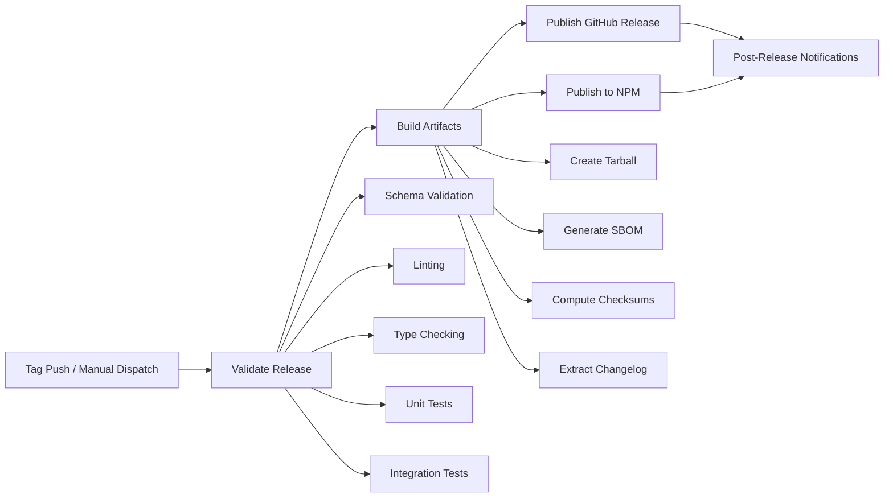

# Release Workflow Runbook

<!-- anchor: release-runbook -->

<!-- prettier-ignore -->
**Document Version**: 1.0.0
**Last Updated**: 2026-01-11
**Part of**: Task I4.T5 - Release Packaging & Checklist

---

## Overview

This runbook documents the Yellow Plugins release workflow, including tagging
conventions, GitHub Actions automation, artifact expectations, and operational
procedures.

**Audience**: Release managers, DevOps engineers, maintainers

**Prerequisites**:

- Read `docs/operations/release-checklist.md` for complete pre-release
  validation steps
- Understand Section 4 directives from project planning documents
- Have `contents: write` permissions on the repository

---

## Quick Reference

| Topic                  | Command/Link                                                |
| ---------------------- | ----------------------------------------------------------- |
| **Trigger Release**    | `git push origin v1.2.3` (tag push)                         |
| **Manual Trigger**     | `gh workflow run publish-release.yml --field version=1.2.3` |
| **Monitor Release**    | `gh run watch`                                              |
| **View Artifacts**     | `gh release view v1.2.3`                                    |
| **Download Artifacts** | `gh release download v1.2.3`                                |
| **Release Checklist**  | `docs/operations/release-checklist.md`                      |
| **Workflow File**      | `.github/workflows/publish-release.yml`                     |

---

## Release Workflow Architecture



**Total Duration**: ~5-15 minutes (depending on test suite size)

**Jobs**:

1. **validate-release** (5-10 min): Validates code, tests, schemas
2. **build-artifacts** (2-5 min): Creates tarball, SBOM, checksums, release
   notes
3. **publish-release** (1-2 min): Creates GitHub Release with assets
4. **publish-npm** (1-3 min): Publishes packages to npm (conditional)
5. **notify** (< 1 min): Sends notifications and status summary

---

## Release Types

### Stable Release (vX.Y.Z)

**Tag Format**: `v1.2.3` (semantic version without pre-release identifier)

**Trigger**:

```bash
git tag -a v1.2.3 -m "Release v1.2.3"
git push origin v1.2.3
```

**Behavior**:

- Full validation suite runs
- GitHub Release created (NOT marked as pre-release)
- NPM publication enabled (if `NPM_TOKEN` configured and on main repository)
- Release notes extracted from `CHANGELOG.md`

**Use Cases**: Production-ready releases, major/minor/patch versions

---

### Pre-Release (vX.Y.Z-identifier)

**Tag Format**: `v1.2.3-beta.1`, `v1.2.3-rc.2`, `v1.2.3-alpha.0`

**Trigger**:

```bash
git tag -a v1.2.3-beta.1 -m "Release v1.2.3-beta.1"
git push origin v1.2.3-beta.1
```

**Behavior**:

- Full validation suite runs
- GitHub Release created (MARKED as pre-release)
- NPM publication **disabled** (pre-releases don't auto-publish to npm)
- Release notes extracted from `CHANGELOG.md`
- "Pre-release" badge shown on GitHub

**Use Cases**: Beta testing, release candidates, early access builds

---

### Manual Dispatch

**Trigger**:

```bash
gh workflow run publish-release.yml \
  --field version="1.2.3" \
  --field prerelease="false"
```

**Behavior**:

- Same as tag-triggered workflow
- Useful for republishing or testing without creating tags
- Requires workflow_dispatch inputs:
  - `version` (required): Version number without 'v' prefix (e.g., "1.2.3")
  - `prerelease` (optional): Boolean flag, defaults to false

**Use Cases**: Re-running failed releases, testing workflow changes, emergency
patches

---

## Tag Naming Conventions

### Semantic Versioning Rules

Follow [Semantic Versioning 2.0.0](https://semver.org/):

- **MAJOR** (X.0.0): Breaking changes, incompatible API changes
- **MINOR** (0.Y.0): New features, backward-compatible additions
- **PATCH** (0.0.Z): Bug fixes, backward-compatible corrections

### Tag Format Requirements

✅ **Valid Tags**:

- `v1.0.0` - Stable release
- `v1.2.3` - Stable release
- `v2.0.0-alpha.1` - Pre-release with identifier
- `v1.5.0-beta.2` - Pre-release with build number
- `v1.0.0-rc.1` - Release candidate

❌ **Invalid Tags** (will NOT trigger workflow):

- `1.0.0` - Missing 'v' prefix
- `v1.0` - Missing patch version
- `release-1.0.0` - Wrong prefix
- `v1.0.0.1` - Too many version parts

### Pre-Release Identifiers

Common identifiers (in order of maturity):

1. **alpha** - Early development, unstable
2. **beta** - Feature-complete, testing phase
3. **rc** (release candidate) - Stable, final testing before release

**Numbering**: Always append build number (e.g., `-alpha.1`, `-beta.2`, `-rc.3`)

---

## Workflow Jobs Breakdown

### Job 1: validate-release

**Duration**: 5-10 minutes **Purpose**: Ensure release candidate meets quality
standards

**Steps**:

1. **Extract version information**
   - From git tag (tag push) or workflow inputs (manual dispatch)
   - Detect pre-release flag from version string (contains `-`)
2. **Setup environment**
   - Node.js 20 + pnpm 8.15.0
   - Install dependencies with frozen lockfile
3. **Validate version consistency**
   - Compare `package.json` version with release version
   - Fail if mismatch detected
4. **Run validation suite**
   - Schema validation (`pnpm validate:schemas`)
   - Linting (`pnpm lint`)
   - Type checking (`pnpm typecheck`)
5. **Run test suites**
   - Unit tests (`pnpm test:unit`)
   - Integration tests (`pnpm test:integration`)

**Outputs**:

- `version`: Extracted release version (e.g., "1.2.3")
- `is_prerelease`: Boolean flag ("true" or "false")

**Failure Handling**: Workflow stops, no artifacts created, no release published

---

### Job 2: build-artifacts

**Duration**: 2-5 minutes **Purpose**: Generate release artifacts for
distribution and audit

**Dependencies**: Requires `validate-release` success

**Steps**:

1. **Build packages**
   - Run `pnpm build` to compile TypeScript
   - Generate dist/ directories for all workspace packages
2. **Extract changelog**
   - Parse `CHANGELOG.md` to extract section for current version
   - Use awk pattern: `/## \[?$VERSION\]?/,/## \[?[0-9]/`
   - Save to `release-notes.md`
   - Falls back to generic message if `CHANGELOG.md` missing
3. **Create tarball**
   - Archive entire repository (excluding node_modules, .git, dist-release,
     .ci-metrics)
   - Filename: `yellow-plugins-v$VERSION.tar.gz`
   - Saved to `dist-release/` directory
4. **Generate SBOM** (Software Bill of Materials)
   - Export full dependency tree as JSON (`pnpm list --json --recursive`)
   - Export human-readable list (`pnpm list --recursive --depth=0`)
   - Files: `sbom.json`, `dependencies.txt`
5. **Compute checksums**
   - SHA256 hashes for all artifacts in `dist-release/`
   - Saved to `SHA256SUMS.txt`

**Artifacts Created**:

- `dist-release/yellow-plugins-v$VERSION.tar.gz` (source archive)
- `dist-release/sbom.json` (dependency tree, JSON format)
- `dist-release/dependencies.txt` (dependency list, human-readable)
- `dist-release/SHA256SUMS.txt` (checksums for verification)
- `release-notes.md` (extracted changelog section)

**Retention**: 90 days (configurable in workflow)

---

### Job 3: publish-release

**Duration**: 1-2 minutes **Purpose**: Create public GitHub Release with
attached assets

**Dependencies**: Requires `validate-release` and `build-artifacts` success

**Permissions**: `contents: write` (creates releases and uploads assets)

**Steps**:

1. **Download artifacts**
   - Retrieve artifacts from `build-artifacts` job
   - Place in `release-artifacts/` directory
2. **Create GitHub Release**
   - Uses `softprops/action-gh-release@v1`
   - Tag: `v$VERSION` (creates tag if manual dispatch)
   - Title: "Release v$VERSION"
   - Body: Contents of `release-notes.md` (from CHANGELOG)
   - Pre-release flag: Set based on `is_prerelease` output
   - Assets: All files in `dist-release/` directory
3. **Enable auto-generated notes**
   - GitHub generates additional release notes from commit history
   - Appended below changelog excerpt

**GitHub Release Contents**:

- Title: "Release v1.2.3"
- Tag: v1.2.3
- Release notes: Extracted from CHANGELOG.md
- Assets:
  - `yellow-plugins-v1.2.3.tar.gz`
  - `sbom.json`
  - `dependencies.txt`
  - `SHA256SUMS.txt`

**Failure Handling**: Workflow continues, but release not published (notify job
reports failure)

---

### Job 4: publish-npm (Conditional)

**Duration**: 1-3 minutes **Purpose**: Publish workspace packages to npm
registry

**Condition**: Runs ONLY if:

- Release is NOT a pre-release (`is_prerelease != 'true'`)
- Repository is main fork (`github.repository == 'kinginyellow/yellow-plugins'`)
- Prevents accidental publishing from forks or pre-releases

**Dependencies**: Requires `validate-release` and `build-artifacts` success

**Steps**:

1. **Setup npm authentication**
   - Configure Node.js with npm registry URL
   - Use `NPM_TOKEN` secret for authentication
2. **Build packages** (rebuild in clean environment)
   - Run `pnpm build`
3. **Publish packages**
   - Command: `pnpm -r publish --access public --no-git-checks`
   - Publishes all workspace packages (`@yellow-plugins/*`)
   - Public access (no private packages)
   - Skips git checks (assumes validation already done)

**Published Packages**:

- `@yellow-plugins/cli@$VERSION`
- `@yellow-plugins/domain@$VERSION`
- `@yellow-plugins/infrastructure@$VERSION`

**Secret Configuration**:

```bash
# Repository Settings → Secrets → Actions → New repository secret
# Name: NPM_TOKEN
# Value: npm publish token with 'Automation' type
```

**Failure Handling**:

- If `NPM_TOKEN` not configured: Logs warning, exits gracefully
- If publish fails: Workflow marked as failed, manual intervention required

---

### Job 5: notify

**Duration**: < 1 minute **Purpose**: Summarize release status and report
success/failure

**Dependencies**: Runs after ALL jobs complete (even if some fail)

**Condition**: `if: always()` (always executes)

**Steps**:

1. **Generate status summary**
   - Display version, pre-release flag, validation result, release result
2. **Success message**
   - If `publish-release` succeeded: Log success notice with emoji
3. **Failure message**
   - If `publish-release` failed: Log error, exit with code 1

**Outputs**: Visible in GitHub Actions summary and workflow logs

---

## Artifact Details

### yellow-plugins-vX.Y.Z.tar.gz

**Type**: Gzipped tarball (source archive)

**Contents**: Complete repository snapshot excluding:

- `node_modules/` - Dependencies (reinstall via pnpm)
- `.git/` - Git history (cloneable from GitHub)
- `dist-release/` - Avoids recursive packaging
- `.ci-metrics/` - Temporary CI artifacts

**Size**: ~500KB - 5MB (depending on code size)

**Usage**:

```bash
# Download
gh release download v1.2.3 --pattern "yellow-plugins-v1.2.3.tar.gz"

# Extract
tar -xzf yellow-plugins-v1.2.3.tar.gz

# Install dependencies
pnpm install

# Build
pnpm build
```

---

### sbom.json

**Type**: JSON (Software Bill of Materials)

**Contents**: Complete dependency tree from `pnpm list --json --recursive`

**Structure**:

```json
[
  {
    "name": "@yellow-plugins/cli",
    "version": "1.2.3",
    "path": "/workspace/packages/cli",
    "dependencies": {
      "yargs": "^18.0.0",
      "@yellow-plugins/domain": "workspace:*",
      ...
    }
  },
  ...
]
```

**Usage**: Security audits, license compliance, dependency tracking

---

### dependencies.txt

**Type**: Plain text

**Contents**: Human-readable dependency list from
`pnpm list --recursive --depth=0`

**Format**:

```
@yellow-plugins/cli 1.2.3
├── yargs 18.0.0
├── @yellow-plugins/domain 1.2.3
└── @yellow-plugins/infrastructure 1.2.3

@yellow-plugins/domain 1.2.3
(no dependencies)

@yellow-plugins/infrastructure 1.2.3
├── ajv 8.12.0
├── ajv-formats 2.1.1
└── ...
```

**Usage**: Quick reference, documentation, changelogs

---

### SHA256SUMS.txt

**Type**: Plain text (checksums)

**Contents**: SHA256 hashes for all artifacts

**Format**:

```
a1b2c3d4... yellow-plugins-v1.2.3.tar.gz
e5f6g7h8... sbom.json
i9j0k1l2... dependencies.txt
```

**Usage**:

```bash
# Verify integrity after download
sha256sum -c SHA256SUMS.txt

# Expected output:
# yellow-plugins-v1.2.3.tar.gz: OK
# sbom.json: OK
# dependencies.txt: OK
```

---

### release-notes.md

**Type**: Markdown (extracted changelog)

**Contents**: Section from `CHANGELOG.md` for current release version

**Extraction Pattern**:

```bash
awk "/## \[?$VERSION\]?/,/## \[?[0-9]/" CHANGELOG.md | head -n -1
```

**Usage**:

- Injected as GitHub Release body
- Provides user-facing release notes
- Includes FR/NFR traceability, feature flags, known limitations

**Fallback**: If `CHANGELOG.md` missing, uses generic message:

```markdown
# Release v1.2.3

No changelog file found.
```

---

## Operational Procedures

### Creating a New Release

**Prerequisites**: Complete `docs/operations/release-checklist.md` before
proceeding

**Steps**:

1. **Ensure main branch is clean and up-to-date**

   ```bash
   git checkout main
   git pull origin main
   git status  # Should be clean
   ```

2. **Verify version consistency**

   ```bash
   # package.json version should match intended release
   node -p "require('./package.json').version"

   # CHANGELOG.md should have entry for this version
   grep "## \[$(node -p "require('./package.json').version")\]" CHANGELOG.md
   ```

3. **Create annotated tag**

   ```bash
   VERSION=$(node -p "require('./package.json').version")
   git tag -a "v$VERSION" -m "Release v$VERSION

   $(awk "/## \[?$VERSION\]?/,/## \[?[0-9]/" CHANGELOG.md | head -n -1)
   "
   ```

4. **Push tag to trigger workflow**

   ```bash
   git push origin "v$VERSION"
   ```

5. **Monitor workflow execution**

   ```bash
   gh run watch
   # Wait for completion (~5-15 minutes)
   ```

6. **Verify release**
   ```bash
   gh release view "v$VERSION"
   ```

**Reference**: `docs/operations/release-checklist.md` Section 5

---

### Monitoring Active Release

**Real-time monitoring**:

```bash
gh run watch
```

**View logs**:

```bash
gh run view --log
```

**Check specific job**:

```bash
gh run view --job=validate-release --log
gh run view --job=build-artifacts --log
gh run view --job=publish-release --log
```

**List recent runs**:

```bash
gh run list --workflow=publish-release.yml --limit 10
```

---

### Downloading Release Artifacts

**From GitHub Release**:

```bash
# All artifacts
gh release download v1.2.3

# Specific artifact
gh release download v1.2.3 --pattern "yellow-plugins-v1.2.3.tar.gz"
```

**From Workflow Artifacts** (90-day retention):

```bash
# Find run ID
gh run list --workflow=publish-release.yml --limit 1 --json databaseId -q '.[0].databaseId'

# Download artifacts from run
gh run download <RUN_ID>
```

---

### Verifying Release Integrity

**1. Verify checksums**:

```bash
gh release download v1.2.3 --pattern "SHA256SUMS.txt"
gh release download v1.2.3
sha256sum -c SHA256SUMS.txt
```

**2. Inspect SBOM**:

```bash
gh release download v1.2.3 --pattern "sbom.json"
jq '.[].name' sbom.json  # List package names
jq '.[].dependencies | keys' sbom.json | head  # Show dependencies
```

**3. Test tarball**:

```bash
gh release download v1.2.3 --pattern "yellow-plugins-v1.2.3.tar.gz"
tar -tzf yellow-plugins-v1.2.3.tar.gz | head -20  # List contents
```

---

### Re-Running Failed Release

**Option 1: Fix and create new version** (recommended)

```bash
# Fix issues in code
# Increment version in package.json (e.g., 1.2.3 → 1.2.4)
# Update CHANGELOG.md with new version
# Create new tag
git tag -a v1.2.4 -m "Release v1.2.4 (fixes v1.2.3 issues)"
git push origin v1.2.4
```

**Option 2: Delete tag and re-release same version** (use cautiously)

```bash
# Delete remote tag
git push origin :refs/tags/v1.2.3

# Delete local tag
git tag -d v1.2.3

# Delete GitHub Release (if created)
gh release delete v1.2.3 --yes

# Fix issues, then recreate tag
git tag -a v1.2.3 -m "Release v1.2.3"
git push origin v1.2.3
```

**Option 3: Manual dispatch** (testing only)

```bash
gh workflow run publish-release.yml \
  --field version="1.2.3" \
  --field prerelease="false"
```

**Caution**: Option 2 may confuse users who already downloaded v1.2.3. Prefer
Option 1 for production.

---

### Emergency Rollback

**If a release is published but found to be broken:**

1. **Mark release as draft** (hides from users)

   ```bash
   gh release edit v1.2.3 --draft
   ```

2. **Add warning to release notes**

   ```bash
   gh release edit v1.2.3 --notes "⚠️ WARNING: This release has been yanked due to [issue]. Please use v1.2.4 instead."
   ```

3. **Delete tags** (prevents re-installation)

   ```bash
   git tag -d v1.2.3
   git push origin :refs/tags/v1.2.3
   ```

4. **Unpublish from npm** (if published, within 72 hours)

   ```bash
   npm unpublish @yellow-plugins/cli@1.2.3
   npm unpublish @yellow-plugins/domain@1.2.3
   npm unpublish @yellow-plugins/infrastructure@1.2.3
   ```

5. **Document incident**
   - Use `docs/operations/postmortem-template.md`
   - Update `CHANGELOG.md` with "## [1.2.3] - YANKED" entry

6. **Release fixed version**
   - Increment to v1.2.4
   - Follow full release checklist

**Reference**: `docs/operations/release-checklist.md` Appendix C

---

## Troubleshooting

### Workflow Doesn't Trigger

**Symptom**: Tag pushed, but workflow not running

**Causes & Solutions**:

1. **Tag format invalid**

   ```bash
   # Check tag format (must match v[0-9]+.[0-9]+.[0-9]+)
   git tag -l | grep "v1.2.3"

   # Delete and recreate with correct format
   git tag -d 1.2.3  # Invalid
   git tag -a v1.2.3 -m "Release v1.2.3"  # Valid
   ```

2. **Workflow file syntax error**

   ```bash
   # Validate YAML syntax
   yamllint .github/workflows/publish-release.yml
   ```

3. **GitHub Actions disabled**
   - Check repository Settings → Actions → General
   - Ensure "Allow all actions" is selected

---

### Version Mismatch Failure

**Symptom**: `validate-release` job fails on version consistency check

**Error Message**: `Version mismatch: package.json (1.2.2) != release (1.2.3)`

**Solution**:

```bash
# Update package.json version
npm version 1.2.3 --no-git-tag-version

# Commit the change
git add package.json
git commit -m "chore: bump version to 1.2.3"
git push origin main

# Delete and recreate tag
git tag -d v1.2.3
git push origin :refs/tags/v1.2.3
git tag -a v1.2.3 -m "Release v1.2.3"
git push origin v1.2.3
```

---

### Test Failures During Release

**Symptom**: `validate-release` job fails on tests

**Solution**:

1. **Reproduce locally**

   ```bash
   pnpm test:unit
   pnpm test:integration
   ```

2. **Review test logs**

   ```bash
   gh run view --job=validate-release --log | grep "FAIL"
   ```

3. **Fix tests and push**

   ```bash
   # Fix broken tests
   git add .
   git commit -m "fix: resolve test failures"
   git push origin main

   # Move tag to new commit
   git tag -d v1.2.3
   git tag -a v1.2.3 -m "Release v1.2.3"
   git push origin v1.2.3 --force
   ```

---

### NPM Publish Fails

**Symptom**: `publish-npm` job fails

**Common Causes**:

1. **Missing NPM_TOKEN**
   - Add secret: Repository Settings → Secrets → Actions → New secret
   - Name: `NPM_TOKEN`
   - Value: Token from npmjs.com (type: Automation)

2. **Version already published**
   - npm doesn't allow re-publishing same version
   - Increment version and re-release

3. **Package name taken**
   - Check `package.json` name fields
   - Ensure `@yellow-plugins/*` scope is available (owned by your npm account)

4. **Network/registry issues**
   - Check npm status: https://status.npmjs.org/
   - Retry workflow after registry recovers

---

### Artifact Upload Fails

**Symptom**: `build-artifacts` uploads artifacts but `publish-release` can't
find them

**Solution**:

1. **Check artifact retention**

   ```bash
   gh run view <RUN_ID> --log | grep "artifact"
   ```

2. **Verify artifact names match**
   - Upload uses: `release-artifacts-v$VERSION`
   - Download expects: `release-artifacts-v$VERSION`

3. **Re-run build-artifacts job**
   ```bash
   gh run rerun --job=build-artifacts
   ```

---

### Changelog Extraction Issues

**Symptom**: Release notes empty or contain wrong content

**Cause**: `CHANGELOG.md` format doesn't match awk pattern

**Solution**:

1. **Verify changelog format**

   ```bash
   # Headings must be: ## [X.Y.Z] - YYYY-MM-DD
   grep "## \[" CHANGELOG.md
   ```

2. **Test extraction locally**

   ```bash
   VERSION="1.2.3"
   awk "/## \[?$VERSION\]?/,/## \[?[0-9]/" CHANGELOG.md | head -n -1
   ```

3. **Fix format and re-release**

   ```markdown
   <!-- Correct format -->

   ## [1.2.3] - 2026-01-11

   ### Added

   - Feature description

   ## [1.2.2] - 2026-01-10
   ```

---

## Security Considerations

### Secret Management

**NPM_TOKEN**:

- **Type**: Automation token (recommended)
- **Scope**: Publish-only access
- **Rotation**: Rotate every 90 days
- **Storage**: GitHub repository secrets (encrypted at rest)

**GitHub Token**:

- **Type**: `GITHUB_TOKEN` (auto-provided by Actions)
- **Permissions**: `contents: write` (declared in workflow)
- **Scope**: Limited to workflow execution

---

### Artifact Integrity

**Checksums**: SHA256SUMS.txt provides integrity verification

**SBOM**: Enables security audits and vulnerability tracking

**Provenance**: GitHub-hosted runners provide build provenance

---

### Supply Chain Security

**Frozen Lockfile**: `pnpm install --frozen-lockfile` prevents dependency drift

**SBOM**: Tracks exact dependency versions for audits

**Dependency Scanning**: Consider adding Dependabot or Snyk (future enhancement)

---

## Performance Targets

| Stage            | Target       | Typical       | Notes                                  |
| ---------------- | ------------ | ------------- | -------------------------------------- |
| validate-release | < 10 min     | 5-8 min       | Depends on test suite size             |
| build-artifacts  | < 5 min      | 2-3 min       | Tarball compression is main bottleneck |
| publish-release  | < 2 min      | 1 min         | Network-dependent (upload artifacts)   |
| publish-npm      | < 5 min      | 2-3 min       | Network-dependent (npm registry)       |
| **Total**        | **< 20 min** | **10-15 min** | End-to-end workflow                    |

**Reference**: Section 4 performance budgets, NFR-PERF-003 (publish ≤ 10 minutes
end-to-end)

---

## Metrics & Monitoring

### Key Performance Indicators (KPIs)

Track these metrics for each release:

- **Release Duration**: Time from tag push to published release
- **Validation Success Rate**: % of releases passing validation on first attempt
- **Artifact Size**: Tarball size over time (indicates code bloat)
- **Dependency Count**: Number of dependencies in SBOM (security/maintenance
  burden)

### Metrics Collection

**Manual Collection**:

```bash
# Release duration
gh run list --workflow=publish-release.yml --json conclusion,startedAt,completedAt

# Artifact sizes
gh release view v1.2.3 --json assets -q '.assets[] | {name, size}'

# Dependency count
gh release download v1.2.3 --pattern "sbom.json"
jq '[.. | .dependencies? // empty | keys] | add | unique | length' sbom.json
```

**Future Automation**: Integrate with `docs/operations/metrics.md` telemetry
stack

---

## Continuous Improvement

### Workflow Optimization Ideas

- [ ] Cache pnpm store across workflow runs (reduce install time)
- [ ] Parallelize test jobs (unit + integration run concurrently)
- [ ] Pre-compile TypeScript in validation job, reuse in build job
- [ ] Add Docker image build + push for CLI distribution
- [ ] Implement matrix testing (multiple Node.js versions)

### Documentation Enhancements

- [ ] Add video walkthrough of release process
- [ ] Create troubleshooting decision tree diagram
- [ ] Document common edge cases and solutions
- [ ] Add release metrics dashboard (visualize KPIs)

### Automation Enhancements

- [ ] Automated version bumping (e.g., `npm version` integration)
- [ ] Changelog generation from conventional commits
- [ ] Slack/email notifications on release success/failure
- [ ] Release drafter (auto-generate draft releases from PRs)

---

## Related Documents

- **Release Checklist**: `docs/operations/release-checklist.md` (gated
  validation steps)
- **CHANGELOG**: `CHANGELOG.md` (historical release notes)
- **Workflow Definition**: `.github/workflows/publish-release.yml` (GitHub
  Actions YAML)
- **CI Documentation**: `docs/operations/ci.md` (CI architecture)
- **Metrics Guide**: `docs/operations/metrics.md` (KPI definitions)
- **Postmortem Template**: `docs/operations/postmortem-template.md` (incident
  analysis)

---

## Contact & Support

**Questions**: Open a GitHub Discussion or Issue

**Emergency Contact**: @KingInYellows (for production incidents)

**Documentation Feedback**: Submit pull requests with improvements

---

<!-- prettier-ignore -->
**Last Updated**: 2026-01-11
**Document Version**: 1.0.0
**Maintained By**: KingInYellows
**Next Review**: 2026-04-11 (quarterly)
