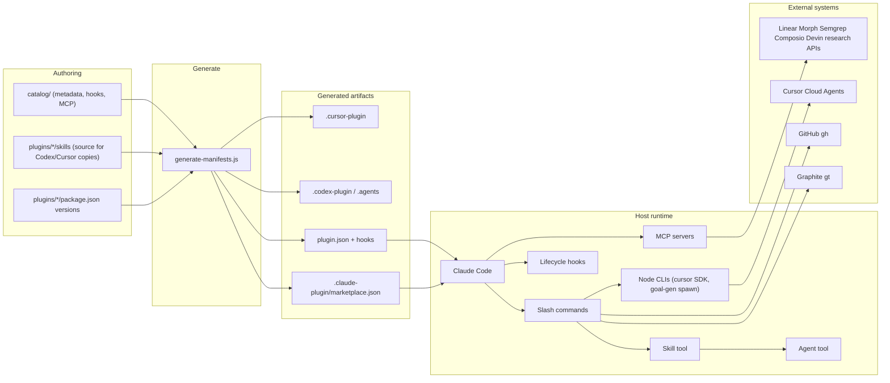

# yellow-plugins Technical Overview

`yellow-plugins` is a git-native Claude Code plugin marketplace (19 plugins)
plus the validation and release tooling that gates it. There is no published
application server. Claude Code (and, opt-in, Codex/Cursor) loads the plugins;
this repository authors, validates, and versions them.

Root catalog version lives in `package.json` (catalog snapshot authority;
`node scripts/catalog-version.js` bumps it on release). `pnpm validate:versions`
checks per-plugin `package.json` ↔ generated manifest/marketplace drift only —
it never reads the root catalog version. Toolchain ranges live in root
`package.json` `engines` (Node `>=22.22.0 <25`, pnpm `>=8`); exact CI pins live
in the workflows under `.github/workflows/` — a workflow-level `NODE_VERSION`
env in `validate-schemas.yml` and `validate-schemas-fork.yml`, and literal
`actions/setup-node` `node-version` values elsewhere (`version-packages.yml`,
`upstream-pins-advisory.yml`, and the `goal-engine-compat` job). The fork-PR
workflow and `goal-engine-compat` pin a newer Node patch than the rest of CI.

---

## Core Components

### Plugin marketplace (`plugins/`, `catalog/`, `.claude-plugin/`)

The product users install. Each plugin is a directory Claude Code discovers by
convention:

| Surface                      | Role                                                                                                    |
| ---------------------------- | ------------------------------------------------------------------------------------------------------- |
| `commands/*.md`              | Slash commands. YAML frontmatter (`name`, `description`, `allowed-tools`) plus an imperative procedure. |
| `skills/<name>/SKILL.md`     | Reusable procedures invoked via the `Skill` tool. Commands often thin-wrap a skill.                     |
| `agents/*.md`                | Subagent prompts spawned via the `Agent` tool.                                                          |
| `hooks/`                     | Host-lifecycle scripts (`SessionStart`, `Stop`, `PreCompact`, `PreToolUse`, …) run as bash or Node.     |
| `mcpServers`                 | Stdio/HTTP MCP servers declared in the generated `plugin.json`.                                         |
| `.claude-plugin/plugin.json` | Generated manifest. Do not hand-edit.                                                                   |

`catalog/` is the source of truth for manifests (field rules:
[`catalog/README.md`](../catalog/README.md)):

- `catalog/catalog.json` — marketplace identity, `pluginOrder`, per-target
  defaults (Claude / Codex / Cursor).
- `catalog/plugins/<name>.json` — shared metadata, hooks, MCP, `userConfig`,
  target enablement, catalog-only `lifecycle` / `capabilityProvider` (never
  emitted into generated artifacts).
- `plugins/<name>/package.json` — sole version authority.

`pnpm generate:manifests` (`scripts/generate-manifests.js`) emits:

- `.claude-plugin/marketplace.json`
- `plugins/<name>/.claude-plugin/plugin.json`
- Codex: `.agents/plugins/`, `plugins/<name>/.codex-plugin/plugin.json`,
  `hooks/codex-hooks.json`, `codex/skills/`
  ([`docs/codex-distribution.md`](codex-distribution.md))
- Cursor (opt-in): `plugins/<name>/.cursor-plugin/plugin.json`,
  `plugins/<name>/cursor/skills/`, root `.cursor-plugin/marketplace.json`
  ([`docs/cursor-distribution.md`](cursor-distribution.md))

Byte-identity drift is gated by `pnpm validate:generated`.

### The 19 plugins

Source of truth for membership and order: `pluginOrder` in
`catalog/catalog.json`. The grouping below is editorial.

#### Orchestration / host toolkit

- **yellow-core** — Hub. `/setup:all`, `/flow:*`, `/stack:select`,
  `/stack:status`, `/plan:*`, worktrees, statusline. Owns
  `lib/stack-provider-state.js`, `stack-operation-registry.js`,
  `stack-tooling-probe.js`, `remote-agent-provider-state.js`,
  `credential-status.sh`. Hooks on `SessionStart` / `Stop` / `PreCompact`.
- **gt-workflow** — Graphite stacked-PR provider (`gt` CLI + Graphite MCP).
  `gt-*` and `smart-submit` commands; Bash hooks block raw `git push`.
- **github-workflow** — GitHub-native stacked-PR provider (`gh stack`). 9
  `/github-stack:*` commands (the GitHub side of the registry's 9 operations)
  plus `lib/github-stack-runtime.js`, the adapter behind `/flow:work`'s
  lower-level stack primitives. Same Bash hook names as gt-workflow, with its
  own policy files (see In-turn and background hooks).

#### Review / quality

- **yellow-review** — Multi-agent PR review, comment resolution, stack review.
  One of two Cursor-enabled plugins (the other is yellow-cursor); its Cursor
  build ships a single read-only skill, `yellow-thermonuclear-review`.
- **yellow-council** — Parallel cross-lineage review (in-process Claude +
  Codex/Gemini/OpenCode CLIs).
- **yellow-debt** — Parallel scanners for AI-generated debt patterns.
- **yellow-semgrep** — Semgrep AppSec “to fix” fetch/fix/verify via MCP.
- **yellow-ci** — CI diagnosis, workflow lint, self-hosted runner health.
- **yellow-docs** — Doc audit/generation/Mermaid.
- **yellow-browser-test** — Autonomous web testing via `agent-browser`.

#### Integrations

- **yellow-linear** — Linear MCP + PM workflows (OAuth).
- **yellow-research** — Multi-source research MCPs (Ceramic, DeepWiki,
  Perplexity, Tavily, EXA, Parallel, ast-grep); missing-key behavior varies by
  server (see MCP and credentials).
- **yellow-morph** — Morph Fast Apply + WarpGrep MCP.
- **yellow-composio** — Composio Connect as a bundled HTTP MCP
  (`https://connect.composio.dev/mcp`, browser OAuth via `/mcp`) plus local
  usage tracking; no hooks, no `userConfig`.
- **yellow-ruvector** — Local ruvector MCP: persistent vector memory and session
  hooks.
- **yellow-codex** — OpenAI Codex CLI wrapper.
- **yellow-cursor** — Cursor Cloud Agents via `@cursor/sdk` (preferred
  remote-agent provider; the other Cursor-enabled plugin, shipped as a native
  Cursor plugin).
- **yellow-devin** — Legacy Devin.AI V3 API (same `remote-agent` group as
  cursor; not preferred).
- **yellow-goal** — Process-spawn bridge to an external `goal-gen` engine (never
  imports it).

### Validation stack (`packages/`, `scripts/`, `schemas/`)

Layered TypeScript, ESLint-enforced direction **cli → infrastructure → domain**:

- **`@yellow-plugins/domain`** — Pure types. `ERROR_CODES`,
  `ValidationErrorFactory`, `IValidator`. No runtime deps.
- **`@yellow-plugins/infrastructure`** — `SchemaValidator` /
  `AjvValidatorFactory`. AJV + semver. Maps AJV errors to domain codes.
- **`@yellow-plugins/cli`** — Thin `yellow-validate` binary. Marketplace
  validation is `scripts/validate-marketplace.js`.

Operational gates are plain CJS scripts in `scripts/`, a second validation stack
beside `packages/`. `packages/domain` is ESM-only, so scripts cannot `require()`
its error catalog; they assemble the same `ERROR-*` strings, and
`scripts/lint-error-codes.js` fails CI if a script hard-codes a code the catalog
already defines. Shared helpers: `scripts/lib/`. JSON schemas live in
`schemas/`. The local plugin schema is not identical to Claude Code’s remote
validator.

### Provider abstraction

Catalog field `capabilityProvider` marks interchangeable implementations.

1. **`stacked-pr`**: `gt-workflow` (graphite) vs `github-workflow` (github).
   Exactly one enabled at runtime.
2. **`remote-agent`**: `yellow-cursor` preferred over `yellow-devin`.

`/stack:status` and `/stack:select` read and switch provider state
(`stack-provider-state.js`, `stack-tooling-probe.js`).
`stack-operation-registry.js` is the provider-operation contract: nine neutral
operations (setup, status, plan, submit, amend, sync, nav, cleanup, merge) map
to each provider's own commands — gt-workflow's `gt-*` / `smart-submit`, or
github-workflow's `/github-stack:*` — and `/flow:work`'s lower-level primitives
map to a `gt` CLI call, a `github-stack-runtime.js` adapter operation, or a
shared step. An entry may be explicit `null` (unsupported: stop; never fall back
to the other provider or to raw `git push` / `gh pr create`). No entry is `null`
today. `/flow:work`'s per-provider steps follow the registry, and
`tests/integration/stack-operation-registry.test.ts` checks every command entry
resolves to a real file. The raw-push ban is also enforced at runtime by the
providers' `PreToolUse` Bash hook (see In-turn and background hooks). The hook
is a backstop, not the only control: `check-git-push` allows the call when it
cannot parse the hook envelope (`lib/run-hook.js`).

---

## Component Interactions



### Typical user action

1. Install marketplace, then `/plugin install <name>@yellow-plugins`.
2. Claude Code copies the plugin into `~/.claude/plugins/cache/` and injects
   `${CLAUDE_PLUGIN_ROOT}`, `${CLAUDE_PLUGIN_DATA}`, `CLAUDE_PLUGIN_OPTION_*`.
3. SessionStart hooks run (credential-status JSON, ruvector store-heal and
   recall, compound drain, CI context).
4. User runs a namespaced slash command. The command markdown usually tells the
   model to invoke a Skill. Skills spawn Agents, run Bash, or call MCP tools.
5. `/setup:all` is the cross-plugin dashboard: one Bash probe, ToolSearch probes
   for session MCP visibility, then per-plugin `credential-status.json` where a
   plugin writes one (no keychain probing). OAuth-only plugins such as
   yellow-composio are classified by MCP tool visibility instead.

### Interfaces

- Manifests: JSON Schema, `additionalProperties: false`.
- Credential status protocol
  ([`docs/plugin-credential-status-protocol.md`](plugin-credential-status-protocol.md)):
  `${CLAUDE_PLUGIN_DATA}/credential-status.json` — presence/source only, never
  secret values. Writer: SessionStart + `credential-status.sh`. Reader:
  `/setup:all`.
- MCP: stdio (`gt mcp`, ruvector, Morph, Semgrep) or HTTP/OAuth (Linear,
  Ceramic, Composio). Credential-bearing stdio MCP servers use userConfig +
  shell env in `plugin.json` and a wrapper in `bin/` that prefers userConfig.
- Stack state: `stack-provider-state.js` classifies `READY_GRAPHITE` /
  `READY_GITHUB` vs blocked states; `/stack:select` switches.
- CLI contracts (`api/cli-contracts/*.json`): JSON Schemas for install / update
  / rollback-style CLI commands that no code in this repo implements (Claude
  Code handles install natively). The `contract-drift` CI job parses them and
  warns when they change. Not a live API.

No DI container. The TypeScript validator uses constructor injection
(`SchemaValidator(factory?)`). Plugins compose by prompt + convention, not
in-process Node imports. Cross-plugin runtime coupling does exist, though, so
changing a yellow-core `lib/` export can break a sibling plugin:

- Node: yellow-linear’s `/linear:delegate` runs yellow-core’s
  `lib/remote-agent-provider-state.js` (and yellow-cursor’s CLI);
  github-workflow’s status/setup skills run yellow-core’s
  `lib/stack-tooling-probe.js`. Each resolves the sibling's path at run time and
  reports an "is yellow-core installed?" error when it is absent.
- Shell: research and Semgrep SessionStart hooks source yellow-core’s
  `credential-status.sh`; debt, CI, ruvector, and goal source `validate-fs.sh`
  (required or best-effort per plugin).

---

## Deployment Architecture

This repo does not deploy a running service. What ships is a **git marketplace**
plus generated host artifacts.

### What is deployed

| Artifact                                           | Consumer                                | How it lands                                                                        |
| -------------------------------------------------- | --------------------------------------- | ----------------------------------------------------------------------------------- |
| Git repo `KingInYellows/yellow-plugins`            | Claude Code `/plugin marketplace add`   | Git clone; `.claude-plugin/marketplace.json` is the catalog                         |
| `plugins/<name>/` tree                             | `/plugin install <name>@yellow-plugins` | Copied into `~/.claude/plugins/cache/yellow-plugins/<name>/<version>/`              |
| Synced `plugin.json` / `marketplace.json` versions | Claude Code update checks               | `sync-manifests.js` after Changesets; hosts compare manifest versions, not git tags |
| Per-plugin git tags (`yellow-core@X.Y.Z`)          | Release tracking                        | `scripts/ci/release-tags.sh` after the Version PR merges                            |
| Catalog tag (`vX.Y.Z`)                             | Humans / tarball snapshot               | Same `release-tags.sh` run; root `package.json` version                             |
| GitHub Release for the catalog tag                 | Humans                                  | `build-and-release` job in `version-packages.yml` (`softprops/action-gh-release`)   |
| `.agents/plugins/` + `.codex-plugin/`              | Codex CLI                               | Generated; `codex plugin marketplace add`                                           |
| `.cursor-plugin/`                                  | Cursor editor                           | Generated, fail-closed; only `yellow-cursor` and `yellow-review`                    |

Plugins are not published to npm. For most plugins, `plugins/*/package.json` is
the Changesets version authority only. Exceptions: `yellow-cursor` and
`yellow-goal` define workspace `build` / `typecheck` / `test` scripts invoked by
root CI; `yellow-core` defines a bats `test` script (CI calls `bats` directly
instead); yellow-cursor declares runtime `@cursor/sdk`; `yellow-morph` pins
`@morphllm/morphmcp` for install into `CLAUDE_PLUGIN_DATA` via
`lib/install-morphmcp.sh`.

### Authoring → generate → commit

```text
catalog/catalog.json + catalog/plugins/<name>.json
  + plugins/<name>/package.json + plugins/<name>/skills/
        │
        ▼
pnpm generate:manifests
        │
        ├── .claude-plugin/marketplace.json
        ├── plugins/<name>/.claude-plugin/plugin.json
        ├── .agents/plugins/ + plugins/<name>/.codex-plugin/ + codex/skills/
        └── .cursor-plugin/marketplace.json + plugins/<name>/.cursor-plugin/
            + cursor/skills/
```

Generated files are committed so hosts can install from git without running the
generator. PR CI never regenerates them; it only runs
`generate-manifests.js --check` (`pnpm validate:generated`, also part of
`validate:schemas`) and fails on any byte drift. The release workflow is the
exception: its Version PR step (`pnpm run version-packages` →
`apply:changesets`) regenerates manifests via `sync-manifests.js` and commits
the result to the Version PR. That bot-created PR does not trigger
`validate-schemas.yml`, so `ci-status` never gates it: review its version files
by hand (root `CLAUDE.md` Fact 3). Separately, `pnpm generate:snippets` rewrites
install-script blocks from `scripts/snippets/*.sh`, and `pnpm validate:snippets`
checks them.

### Build steps

Local pre-PR baseline (run `pnpm generate:manifests` first only if you edited
`catalog/`, a plugin `package.json`, or a Codex/Cursor-exported skill, then
commit the output). This is not the full CI gate — root `CLAUDE.md` “Common
Commands” lists what `ci-status` adds (changeset, required bats suites, and
more):

```text
pnpm install --frozen-lockfile
pnpm build
pnpm validate:schemas
pnpm validate:versions
pnpm test:unit && pnpm test:integration
pnpm lint && pnpm typecheck
```

`preinstall` runs `scripts/check-node-version.js` and `only-allow pnpm`.
`pnpm release:check` is the pre-tag subset.

### CI

Primary workflow: `.github/workflows/validate-schemas.yml`.

- Triggers: PR (path-filtered), push to `main`, `workflow_dispatch`.
- Runners: GitHub-hosted `ubuntu-latest`. The primary workflow skips fork PRs;
  `.github/workflows/validate-schemas-fork.yml` validates fork PRs on
  `ubuntu-latest`. Codex live-install also uses `windows-latest`.
- Token: workflow `contents: read`. `GITHUB_TOKEN` is passed into `pnpm install`
  so `@vscode/ripgrep` (via yellow-morph) can download from GitHub Releases.

Blocking jobs are exactly the `needs:` list of the `ci-status` aggregator in
`validate-schemas.yml` — read the list there rather than from any doc. Inside
`plugin-shell-tests`, only the yellow-core, yellow-council, yellow-review, and
yellow-codex bats suites are required; other plugins' suites run
`continue-on-error`. The 60s per-target schema SLO is checked by
`report-metrics`, which is not in `ci-status` and does not block merge.

Advisory: `codex-install-verification` installs the unpinned latest Codex CLI
and checks named membership of every Codex-enabled plugin.

Sibling workflows: everything else in `.github/workflows/` — currently the
fork-PR validator, plugin-convention lint, `version-packages.yml` (release),
Claude review and `@claude` mention workflows, and an upstream-pins advisory.

### Containerization

`Dockerfile` is a CI image, not a production runtime: a digest-pinned Node slim
image and a pinned pnpm (versions in the `Dockerfile`), default
`CMD pnpm validate:schemas`. GitHub Actions uses `actions/setup-node` +
`pnpm/action-setup`, not this image.

### Release / versioning

Three independent version numbers:

1. **Per-plugin** — `plugins/<name>/package.json` synced into `plugin.json` and
   `marketplace.json`.
2. **Catalog** — root `package.json`, tagged `vX.Y.Z`. Independent of plugin
   semver; each Version PR patch-bumps it as a marketplace snapshot.
3. **Marketplace metadata** — `metadata.version` in `catalog/catalog.json`,
   emitted into `marketplace.json`. Neither the root `package.json` version nor
   any plugin version (see `catalog/README.md` “Versions”).

Release flow (changeset → Version PR → tags → GitHub Release) and recovery are
documented in `docs/operations/versioning.md` and `docs/CLAUDE.md`.

### Host install paths

| Host               | Marketplace add                                                                         | Install root                                           |
| ------------------ | --------------------------------------------------------------------------------------- | ------------------------------------------------------ |
| Claude Code (user) | `/plugin marketplace add KingInYellows/yellow-plugins`                                  | `~/.claude/plugins/cache/`                             |
| Claude Code (dev)  | `/plugin marketplace add ./`                                                            | same cache; `${CLAUDE_PLUGIN_ROOT}` points at the copy |
| Codex              | `codex plugin marketplace add <repo>`                                                   | `$CODEX_HOME`                                          |
| Cursor             | Docs-claimed, not live-verified: `~/.cursor/plugins/local/<name>/` or Customize sidebar | generated `.cursor-plugin/plugin.json`                 |

See `docs/cursor-distribution.md` “Local Cursor loading procedure” for the
caveats on the Cursor row.

Required host tools vary by plugin (`git`, `node`, `jq`, `gh`, `gt`, plus
optional CLIs). API keys live in shell env, Claude `userConfig`, or OAuth. Never
in git.

---

## Runtime Behavior

Runtime is the agent host. The host loads manifests, injects env, starts MCP
children, fires hooks, then the model executes command/skill markdown via tools.

### Session start

1. Host opens a session in a project (`cwd` / `CLAUDE_PROJECT_DIR`).
2. Enabled plugins load from cache. Host sets `CLAUDE_PLUGIN_ROOT`,
   `CLAUDE_PLUGIN_DATA`, and `userConfig`.
3. MCP servers spawn from `mcpServers` (stdio wrappers or HTTP URLs).
4. SessionStart hooks run with 3–5s timeouts. Heavy work is disowned.
5. Commands and skills are listed into the model’s tool budget.

Hook I/O:

- `SessionStart` / `Stop`: stdout is `{"continue": true}`, optionally with a
  `systemMessage` or (ruvector) `hookSpecificOutput.additionalContext`. Scripts
  omit `set -e` so a failure cannot skip that JSON and block the session.
- `PreCompact`: plain text appended to the compaction prompt (not JSON). Exit 0
  always.
- `PreToolUse` on Bash (gt-workflow / github-workflow `check-git-push`): no
  output to allow; to deny, exit 2 with the reason on stderr.
- `PostToolUse` on Bash (`check-commit-message`): `{"continue": true}`, plus a
  `systemMessage` warning when a commit message is not a conventional commit.
- Stdin is a JSON envelope (`cwd`, `session_id`, `transcript_path`,
  `tool_input`, …).

Summary only; each plugin's `catalog/plugins/<name>.json` hooks block and its
`CLAUDE.md` are the source of truth.

| Plugin          | SessionStart work                                                                                                        |
| --------------- | ------------------------------------------------------------------------------------------------------------------------ |
| yellow-core     | Compound-staging drain dispatcher. Guard: `COMPOUND_DRAIN_IN_PROGRESS=1`.                                                |
| yellow-ci       | Shared 3s budget: optional `gh run list`, 500-byte routing cache, defanged `systemMessage`.                              |
| yellow-debt     | Scans `todos/debt/` for pending/ready high/critical findings; emits a `systemMessage` warning if any exist.              |
| yellow-research | Write `credential-status.json`; disown Context7 `_lc_prewarm` (lockfile scan, HTTP library-ID resolution, cache update). |
| yellow-semgrep  | Write `credential-status.json` (presence/source only).                                                                   |
| yellow-morph    | Prewarms morphmcp only; does not write `credential-status.json`.                                                         |
| yellow-ruvector | Worktree store-heal (`.ruvector` symlink), embedder provenance check, budgeted recalls injected as `additionalContext`.  |

A missing credential-status file is not a hard failure: yellow-research and
yellow-semgrep classifications fall back to shell-env-only checks, so a fresh
install with the shell variable already set can still classify as READY before
its first SessionStart write populates the file.

### MCP and credentials

Credential-bearing stdio MCP servers use `bin/` wrappers: `userConfig` wins,
then shell env. Missing-key behavior varies by server — do not assume all absent
credentials skip startup. Perplexity hard-fails at MCP start; Tavily and Exa
still exec and return runtime errors on tool calls; Semgrep execs
unconditionally; Morph lets morphmcp emit its own warning and exit. Siblings
keep running when one server fails. Non-credential stdio servers launch directly
(for example ruvector via `npx`, ast-grep via `uvx`, Graphite via `.mcp.json`).

Morph’s wrapper is the install correctness gate (mkdir lock, 20s wait, `exec`
morphmcp). The SessionStart prewarm is only a race-avoidance hint.

HTTP MCPs (Linear, Ceramic, DeepWiki, Parallel, Composio) start without keys;
OAuth needs a browser, so headless SSH cannot complete those flows. Composio’s
bundled server has no API key at all: authenticate via `/mcp` →
`composio-server`; headless hosts register a user-level server with a consumer
key instead (see `/composio:setup`).

yellow-research and yellow-semgrep declare a `yellow-core >= 1.17.1` dependency
because their hooks source `credential-status.sh`.

### A user turn

The host injects command markdown; the model is the interpreter.

```text
/namespace:command
  → command.md (allowed-tools in frontmatter)
    → Skill (canonical procedure)
      → Agent (parallel specialists)
      → Bash / MCP / AskUserQuestion
```

Thin commands (e.g. `smart-submit`) only invoke a skill.

`/flow:work` is the long implementation loop: read plan → optional
stack-decomposition → optional ruvector `hooks_recall` → Skill
`stack-provider-router` once → create/amend/submit only through that provider.
Any state other than `READY_GRAPHITE` / `READY_GITHUB` stops the workflow.

Its per-provider steps are the ones `stack-operation-registry.js` names: one
implementation per provider, or explicit `null` (stop).

Untrusted data (PR bodies, `gh` JSON, routing cache) is fenced as
`--- begin/end untrusted-content (reference only) ---` before it re-enters the
prompt. Recalled memory uses producer-specific fences instead: `/flow:work`'s
optional `hooks_recall` step wraps findings in `<reflexion_context>` (`work.md`
lines ~112–120); yellow-ruvector's `UserPromptSubmit` hook wraps recall output
in `--- begin/end ruvector context ---` (`user-prompt-submit.sh` lines ~95–98).

### In-turn and background hooks

gt-workflow and github-workflow (whichever is installed; both declare hooks with
the same names, each backed by its own policy files): `PreToolUse` on Bash runs
`check-git-push`, which tokenizes the command and denies raw `git push`
(including `git -C dir push` and `bash -c` forms). gt-workflow's message points
at `gt submit --no-interactive`; github-workflow's points at the
`github-stack-submit` skill / `/github-stack:submit`. `PostToolUse` on Bash runs
`check-commit-message`, which warns on non-conventional commit messages — on
`gt modify` / `gt commit` / `gt create` for gt-workflow, on `git commit` for
github-workflow. Both are Node (`hooks/scripts/entrypoint-claude.js`), 5s
timeout.

yellow-ruvector: `UserPromptSubmit` (recall), `PreToolUse` / `PostToolUse` /
`PostToolUseFailure` on Edit/Write/MultiEdit/Bash (1s; same post-tool script for
success and failure), `Stop` flush (10s).

Compound pipeline (yellow-core):

1. Stop (<500ms): if not re-entrant and not a drain session, disown transcript
   capture into `pending/*.jsonl`.
2. Next SessionStart, threshold met (pending ≥5 or oldest >48h): acquire drain
   lock → requeue any crashed `processing/` entries → async `claude -p`.
3. Next SessionStart, threshold not met but `processing/` has an entry >60 min
   old: acquire drain lock, requeue that entry back to `pending/`, release the
   lock, and exit (`REQUEUE_ONLY=1` — no `claude -p` yet). Recovery waits for a
   later SessionStart that meets the dispatch threshold.
4. Interactive path: `/compound:review-staged` (skips threshold check).

PreCompact tells the summarizer to keep, verbatim: active plan + unchecked
tasks, files touched, user decisions, open questions, last failing command,
in-flight branch/PR/worktree/stack names. The same text instructs the summarizer
to replace detected secrets with a redaction marker and wrap each preserved item
in an untrusted-content fence; no code redacts — it is a prompt instruction
only.

### Subprocesses that are real Node

Not app servers — children of the host or a wrapper:

- yellow-cursor (`@cursor/sdk` CLI)
- yellow-goal (spawns `goal-gen`; never imports it)
- github-workflow `github-stack-runtime.js` (JSON `status` / `recoveryAction`)
- Hook entrypoints: yellow-ci (SessionStart), gt-workflow and github-workflow
  (Bash `PreToolUse` / `PostToolUse`)
- Morph/research/semgrep MCP wrappers (`exec` the binary)

MCP stdio children live for the session; the host owns them.

---

## Error Handling

Two layers: authoring/CI (blocks merge) and runtime (must not take down the
host). There is no central exception bus.

### Authoring / CI

Validators emit `ERROR-*` codes defined in `packages/domain`
(`src/validation/errorCatalog.ts`, plus `error-codes.json` for `DIST`); that
catalog, not this table, is the full list.

| Class             | Examples                        | Effect                                       |
| ----------------- | ------------------------------- | -------------------------------------------- |
| Schema            | `ERROR-SCHEMA-*`                | Invalid marketplace/plugin JSON              |
| Setup coverage    | `ERROR-SETUP-*`                 | `/setup:all` drifted from marketplace        |
| Providers         | `ERROR-PROVIDER-*`              | Capability-group declaration bugs            |
| Solutions / plans | `ERROR-SOL-*`, `ERROR-PLAN-001` | Slug/frontmatter; archived plan with `- [ ]` |
| Namespace         | `ERROR-NAMESPACE-*`             | Stale `workflows:` references                |
| Cursor            | `ERROR-CURSOR-*`                | Generated Cursor artifacts / exposure        |
| Versions          | `validate-versions.js`          | Three-way (and Codex/Cursor two-way) drift   |

The `ci-status` aggregator is the merge gate (job list under CI above). Codex
live-install is advisory so an upstream CLI outage does not block unrelated PRs.

Operators: `docs/operations/runbook.md` — `gh run view`, local
`pnpm validate:schemas`, inspect `~/.claude/plugins/cache/`.

### Runtime: degrade, don’t block

| Failure                             | Mechanism                                                                                                                                                                           |
| ----------------------------------- | ----------------------------------------------------------------------------------------------------------------------------------------------------------------------------------- |
| Hook crash / write fail             | stderr only; still emit `{"continue": true}` or empty `systemMessage`                                                                                                               |
| `set -e` avoided in hooks           | unexpected non-zero cannot skip the continue JSON                                                                                                                                   |
| Raw `git push` in Bash              | stacked-PR provider `PreToolUse` hook denies it (exit 2); an unparseable command is denied as a precaution                                                                          |
| Missing MCP key                     | varies by server (see MCP and credentials): Perplexity hard-fails at MCP start; Tavily/Exa still exec and error on tool calls; Semgrep execs unconditionally; Morph warns and exits |
| Morph install lock timeout (20s)    | wrapper exits 1; `/morph:setup`; session continues without Morph                                                                                                                    |
| Stack not `READY_*`                 | stop; print router `detail` inside an untrusted fence                                                                                                                               |
| Registry `null`                     | stop; never try the other provider or raw git/gh                                                                                                                                    |
| ruvector recall timeout             | MCP-driven recalls wait ~500ms and retry once; hook recalls get one attempt, no retry; then continue without memory                                                                 |
| Credential-status missing/malformed | `/setup:all` falls back to shell-env checks where a plugin defines one, else unknown; suggest restart. Never read the keychain                                                      |
| `disableAllHooks`                   | all plugin hooks skipped (dashboard reports it)                                                                                                                                     |
| Drain recursion                     | `COMPOUND_DRAIN_IN_PROGRESS=1` no-ops Stop/SessionStart                                                                                                                             |
| Concurrent drain                    | `mkdir .drain-lock` fails → skip; stale dir lock >30 min reaped; stray file lock deleted                                                                                            |
| Untrusted hook/cache I/O            | `O_NOFOLLOW`, `O_NONBLOCK` (no FIFO stall), uid check, 500-byte cap, defang + fence                                                                                                 |
| Compaction                          | PreCompact never exit-2; compaction proceeds even if preserve-list is all that survives                                                                                             |

### Retry and timeout policy

- Host hook timeouts are the hard ceiling. Each hook's timeout (1–10s) is
  declared in `catalog/plugins/<name>.json`; read it there.
- yellow-ci’s two `gh` calls share one 3s deadline minus a 400ms reserve; if
  budget is gone the call is skipped, not started.
- ruvector: MCP-driven recalls (`/ruvector:learn`'s dedup check,
  `ruvector-semantic-search`) retry once after ~500ms on timeout/connection
  errors, then fall back (abort storage, or Grep); hook-triggered recalls
  (`user-prompt-submit.sh`, `session-start.sh`) get one bounded CLI attempt and
  no retry — on timeout or failure the output is cleared and the hook continues
  silently. The `memory-query` skill's automatic recall path discards results
  with score < 0.5, or < 0.40 for its error-fix recall (user-facing
  `/ruvector:search` and `semantic-search` still show low-score hits with a
  confidence warning).
- MCP wrappers: no request retries; fail the child, leave the session up.
- Compound drain: crashed work is requeued, not retried in-process.

### Security-shaped errors

- Credential-status files must not contain secret values (review-enforced).
- Untrusted text is defanged (`--- begin/end`, `` `$<> ``, Unicode whitespace)
  before it can become instructions.
- Cache/status writes use temp file + atomic rename; a failed write prints a
  one-line stderr warning and returns 0, never blocking the hook.
- Protected-directory prompts on `CLAUDE_PLUGIN_DATA` are handled the same way:
  `credential-status.sh` warns on stderr and skips the write so SessionStart
  never blocks.
