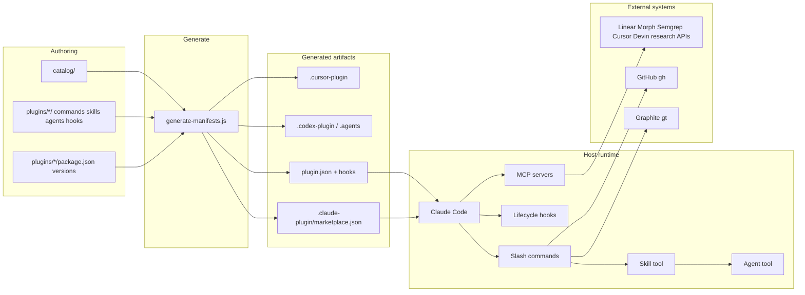

# yellow-plugins Technical Overview

`yellow-plugins` is a git-native Claude Code plugin marketplace (19 plugins)
plus the validation and release tooling that gates it. There is no published
application server. Claude Code (and, opt-in, Codex/Cursor) loads the plugins;
this repository authors, validates, and versions them.

Root catalog version lives in `package.json` (catalog snapshot authority;
`node scripts/catalog-version.js` bumps it on release). `pnpm validate:versions`
checks per-plugin `package.json` ↔ generated manifest/marketplace drift only —
it never reads the root catalog version. Toolchain: Node `>=22.22.0 <25`, pnpm
`>=8` (CI pins Node `22.22.0` and pnpm `8.15.0`).

---

## Core Components

### Plugin marketplace (`plugins/`, `catalog/`, `.claude-plugin/`)

The product users install. Each plugin is a directory Claude Code discovers by
convention:

| Surface                      | Role                                                                                                    |
| ---------------------------- | ------------------------------------------------------------------------------------------------------- |
| `commands/*.md`              | Slash commands. YAML frontmatter (`name`, `description`, `allowed-tools`) plus an imperative procedure. |
| `skills/<name>/SKILL.md`     | Reusable procedures invoked via the `Skill` tool. Commands often thin-wrap a skill.                     |
| `agents/*.md`                | Subagent prompts spawned via the `Agent` tool.                                                          |
| `hooks/`                     | Host-lifecycle scripts (`SessionStart`, `Stop`, `PreCompact`, …) run as bash or Node.                   |
| `mcpServers`                 | Stdio/HTTP MCP servers declared in the generated `plugin.json`.                                         |
| `.claude-plugin/plugin.json` | Generated manifest. Do not hand-edit.                                                                   |

`catalog/` is the source of truth for manifests:

- `catalog/catalog.json` — marketplace identity, `pluginOrder`, per-target
  defaults (Claude / Codex / Cursor).
- `catalog/plugins/<name>.json` — shared metadata, hooks, MCP, `userConfig`,
  target enablement, catalog-only `lifecycle` / `capabilityProvider` (never
  emitted into generated artifacts).
- `plugins/<name>/package.json` — sole version authority.

`pnpm generate:manifests` (`scripts/generate-manifests.js`) emits:

- `.claude-plugin/marketplace.json`
- `plugins/<name>/.claude-plugin/plugin.json`
- Codex: `.agents/plugins/`, `plugins/<name>/.codex-plugin/plugin.json`,
  `hooks/codex-hooks.json`, `codex/skills/`
- Cursor (opt-in): `plugins/<name>/.cursor-plugin/plugin.json`, root
  `.cursor-plugin/marketplace.json`

Byte-identity drift is gated by `pnpm validate:generated`.

### The 19 plugins

#### Orchestration / host toolkit

- **yellow-core** — Hub. `/setup:all`, `/flow:*`, `/stack:*`, `/plan:*`,
  worktrees, statusline. Owns `lib/stack-provider-state.js`,
  `stack-operation-registry.js`, `stack-tooling-probe.js`,
  `remote-agent-provider-state.js`, `credential-status.sh`. Hooks on
  `SessionStart` / `Stop` / `PreCompact`.
- **gt-workflow** — Graphite stacked-PR provider (`gt` CLI + Graphite MCP).
- **github-workflow** — GitHub-native stacked-PR provider (`gh` +
  `lib/github-stack-runtime.js`). Same nine `/stack:*` operations via an
  adapter.

#### Review / quality

- **yellow-review** — Multi-agent PR review, comment resolution, stack review.
  Second Cursor-enabled plugin (read-only skill only).
- **yellow-council** — Parallel cross-lineage review (in-process Claude +
  Codex/Gemini/OpenCode CLIs).
- **yellow-debt** — Parallel scanners for AI-generated debt patterns.
- **yellow-semgrep** — Semgrep AppSec “to fix” fetch/fix/verify via MCP.
- **yellow-ci** — CI diagnosis, workflow lint, self-hosted runner health.
- **yellow-docs** — Doc audit/generation/Mermaid.
- **yellow-browser-test** — Autonomous web testing via `agent-browser`.

#### Integrations

- **yellow-linear** — Linear MCP + PM workflows (OAuth).
- **yellow-research** — Multi-source research MCPs (Ceramic, DeepWiki,
  Perplexity, Tavily, EXA, Parallel, ast-grep); missing keys skip that provider.
- **yellow-morph** — Morph Fast Apply + WarpGrep MCP.
- **yellow-composio** — Composio MCP with usage/budget guards.
- **yellow-ruvector** — Local ruvector MCP: persistent vector memory and session
  hooks.
- **yellow-codex** — OpenAI Codex CLI wrapper.
- **yellow-cursor** — Cursor Cloud Agents via `@cursor/sdk` (preferred
  remote-agent provider; also a native Cursor plugin).
- **yellow-devin** — Legacy Devin.AI V3 API (same `remote-agent` group as
  cursor; not preferred).
- **yellow-goal** — Process-spawn bridge to an external `goal-gen` engine (never
  imports it).

### Validation stack (`packages/`, `scripts/`, `schemas/`)

Layered TypeScript, ESLint-enforced direction **cli → infrastructure → domain**:

- **`@yellow-plugins/domain`** — Pure types. `ERROR_CODES`,
  `ValidationErrorFactory`, `IValidator`. No runtime deps.
- **`@yellow-plugins/infrastructure`** — `SchemaValidator` /
  `AjvValidatorFactory`. AJV + semver. Maps AJV errors to domain codes.
- **`@yellow-plugins/cli`** — Thin `yellow-validate` binary. Marketplace
  validation is `scripts/validate-marketplace.js`.

Operational gates live in CJS `scripts/` because scripts are CJS and domain is
ESM. Shared helpers: `scripts/lib/`. JSON schemas live in `schemas/`. The local
plugin schema is not identical to Claude Code’s remote validator.

### Provider abstraction

Catalog field `capabilityProvider` marks interchangeable implementations.

1. **`stacked-pr`**: `gt-workflow` (graphite) vs `github-workflow` (github).
   Exactly one enabled at runtime.
2. **`remote-agent`**: `yellow-cursor` preferred over `yellow-devin`.

`stack-operation-registry.js` maps nine `/stack:*` ops plus `flow:work`
primitives to a command, CLI, adapter, shared step, or explicit `null` (stop;
never fall back to the other provider or to raw `git push` / `gh pr create`).

---

## Component Interactions



### Typical user action

1. Install marketplace, then `/plugin install <name>@yellow-plugins`.
2. Claude Code copies the plugin into `~/.claude/plugins/cache/` and injects
   `${CLAUDE_PLUGIN_ROOT}`, `${CLAUDE_PLUGIN_DATA}`, `CLAUDE_PLUGIN_OPTION_*`.
3. SessionStart hooks run (credential-status JSON, ruvector init, compound
   drain, CI context).
4. User runs a namespaced slash command. The command markdown usually tells the
   model to invoke a Skill. Skills spawn Agents, run Bash, or call MCP tools.
5. `/setup:all` is the cross-plugin dashboard: one Bash probe, then reads
   per-plugin `credential-status.json` (no keychain probing).

### Interfaces

- Manifests: JSON Schema, `additionalProperties: false`.
- Credential status protocol: `${CLAUDE_PLUGIN_DATA}/credential-status.json` —
  presence/source only, never secret values. Writer: SessionStart +
  `credential-status.sh`. Reader: `/setup:all`.
- MCP: stdio (`gt mcp`, ruvector, Morph, Semgrep) or HTTP/OAuth (Linear,
  Ceramic). Credential MCP servers use userConfig + shell env in `plugin.json`
  and a wrapper in `bin/` that prefers userConfig.
- Stack state: `stack-provider-state.js` classifies `READY_GRAPHITE` /
  `READY_GITHUB` vs blocked states; `/stack:select` switches.
- CLI contracts (`api/cli-contracts/*.json`): fixtures for validators, not a
  live API.

No DI container. The TypeScript validator uses constructor injection
(`SchemaValidator(factory?)`). Plugins compose by prompt + convention, not
in-process Node imports (except yellow-cursor’s SDK CLI and yellow-goal’s
process spawn). Runtime shell coupling does exist: research, Semgrep, and
Composio SessionStart hooks source yellow-core’s `credential-status.sh`; debt,
CI, ruvector, and goal source `validate-fs.sh` (required or best-effort per
plugin).

---

## Deployment Architecture

This repo does not deploy a running service. What ships is a **git marketplace**
plus generated host artifacts.

### What is deployed

| Artifact                                           | Consumer                                | How it lands                                                                        |
| -------------------------------------------------- | --------------------------------------- | ----------------------------------------------------------------------------------- |
| Git repo `KingInYellows/yellow-plugins`            | Claude Code `/plugin marketplace add`   | Git clone; `.claude-plugin/marketplace.json` is the catalog                         |
| `plugins/<name>/` tree                             | `/plugin install <name>@yellow-plugins` | Copied into `~/.claude/plugins/cache/yellow-plugins/<name>/<version>/`              |
| Synced `plugin.json` / `marketplace.json` versions | Claude Code update checks               | `sync-manifests.js` after Changesets; hosts compare manifest versions, not git tags |
| Per-plugin git tags (`yellow-core@X.Y.Z`)          | Release tracking                        | `scripts/ci/release-tags.sh` after the Version PR merges                            |
| Catalog tag + GitHub Release (`vX.Y.Z`)            | Humans / tarball snapshot               | Same publish phase; root `package.json` version                                     |
| `.agents/plugins/` + `.codex-plugin/`              | Codex CLI                               | Generated; `codex plugin marketplace add`                                           |
| `.cursor-plugin/`                                  | Cursor editor                           | Generated, fail-closed; only `yellow-cursor` and `yellow-review`                    |

Plugins are not published to npm. For most plugins, `plugins/*/package.json` is
the Changesets version authority only. Exceptions: `yellow-cursor` and
`yellow-goal` also define workspace `build` / `typecheck` / `test` scripts
invoked by root CI; yellow-cursor additionally declares its runtime
`@cursor/sdk` dependency.

### Authoring → generate → commit

```text
catalog/catalog.json + catalog/plugins/<name>.json
        │
        ▼
pnpm generate:manifests
        │
        ├── .claude-plugin/marketplace.json
        ├── plugins/<name>/.claude-plugin/plugin.json
        ├── .agents/plugins/ + plugins/<name>/.codex-plugin/
        └── .cursor-plugin/marketplace.json + plugins/<name>/.cursor-plugin/
```

Generated files are committed so hosts can install from git without running the
generator. `pnpm generate:snippets` rewrites install-script blocks from
`scripts/snippets/*.sh`. `pnpm validate:generated` fails on any byte drift.

### Build steps

```text
pnpm install --frozen-lockfile
pnpm generate:manifests
pnpm build
pnpm validate:schemas
pnpm validate:versions
pnpm test:unit && pnpm test:integration
pnpm lint && pnpm typecheck
```

`preinstall` runs `scripts/check-node-version.js` and `only-allow pnpm`.
`pnpm release:check` is the pre-tag subset.

### CI

Primary workflow: `.github/workflows/validate-schemas.yml`.

- Triggers: PR (path-filtered), push to `main`, `workflow_dispatch`.
- Runners: GitHub-hosted `ubuntu-latest`. Fork PRs skipped. Codex live-install
  also uses `windows-latest`.
- Token: workflow `contents: read`. `GITHUB_TOKEN` is passed into `pnpm install`
  so `@vscode/ripgrep` (via yellow-morph) can download from GitHub Releases.

Blocking jobs include a 10-target `validate-schemas` matrix with a 60s SLO,
lint/typecheck, unit/integration tests, versions, changeset-check (PR-only),
Bats plugin-shell tests, goal-engine-compat, and a `ci-status` aggregator.

Advisory: `codex-install-verification` installs the unpinned latest Codex CLI
and checks named membership of every Codex-enabled plugin.

Sibling workflows: `lint-plugins.yml`, `version-packages.yml`,
`claude-code-review.yml`, `upstream-pins-advisory.yml`.

### Containerization

`Dockerfile` is a CI image, not a production runtime: digest-pinned
`node:22.22.0-slim`, pnpm `8.15.0`, default `CMD pnpm validate:schemas`. GitHub
Actions uses `actions/setup-node` + `pnpm/action-setup`, not this image.

### Release / versioning

Two version namespaces:

1. **Per-plugin** — `plugins/<name>/package.json` synced into `plugin.json` and
   `marketplace.json`.
2. **Catalog** — root `package.json`, tagged `vX.Y.Z`. Independent of plugin
   semver; each Version PR patch-bumps it as a marketplace snapshot.

Flow: plugin change + `.changeset/*.md` → Version PR (`pnpm version-packages`) →
merge → `scripts/ci/release-tags.sh` → per-plugin tags, catalog tag, GitHub
Release. Recovery: `gh workflow run version-packages.yml -f force_publish=true`.

### Host install paths

| Host               | Marketplace add                                        | Install root                                           |
| ------------------ | ------------------------------------------------------ | ------------------------------------------------------ |
| Claude Code (user) | `/plugin marketplace add KingInYellows/yellow-plugins` | `~/.claude/plugins/cache/`                             |
| Claude Code (dev)  | `/plugin marketplace add ./`                           | same cache; `${CLAUDE_PLUGIN_ROOT}` points at the copy |
| Codex              | `codex plugin marketplace add <repo>`                  | `$CODEX_HOME`                                          |
| Cursor             | `~/.cursor/plugins/local/<name>/` or Customize sidebar | generated `.cursor-plugin/plugin.json`                 |

Required host tools vary by plugin (`git`, `node`, `jq`, `gh`, `gt`, plus
optional CLIs). API keys live in shell env, Claude `userConfig`, or OAuth. Never
in git.

---

## Runtime Behavior

Runtime is the agent host. The host loads manifests, injects env, starts MCP
children, fires hooks, then the model executes command/skill markdown via tools.

### Session start

1. Host opens a session in a project (`cwd` / `CLAUDE_PROJECT_DIR`).
2. Enabled plugins load from cache. Host sets `CLAUDE_PLUGIN_ROOT`,
   `CLAUDE_PLUGIN_DATA`, and `userConfig`.
3. MCP servers spawn from `mcpServers` (stdio wrappers or HTTP URLs).
4. SessionStart hooks run with 3–5s timeouts. Heavy work is disowned.
5. Commands and skills are listed into the model’s tool budget.

Hook I/O:

- `SessionStart` / `Stop`: stdout is `{"continue": true}`. Scripts omit `set -e`
  so a failure cannot skip that JSON and block the session.
- `PreCompact`: plain text appended to the compaction prompt (not JSON). Exit 0
  always.
- Stdin is a JSON envelope (`cwd`, `session_id`, `transcript_path`, …).

| Plugin                        | SessionStart work                                                                           |
| ----------------------------- | ------------------------------------------------------------------------------------------- |
| yellow-core                   | Compound-staging drain dispatcher. Guard: `COMPOUND_DRAIN_IN_PROGRESS=1`.                   |
| yellow-ci                     | Shared 3s budget: optional `gh run list`, 500-byte routing cache, defanged `systemMessage`. |
| research / semgrep / composio | Write `credential-status.json` (presence/source only).                                      |
| yellow-morph                  | SessionStart prewarms morphmcp only; credential-status is a follow-up.                      |
| yellow-ruvector               | Vector-store / MCP warmup.                                                                  |

Missing credential-status files are “unknown” to `/setup:all`, not a hard
failure.

### MCP and credentials

Credential-bearing stdio MCP servers use `bin/` wrappers: `userConfig` wins,
then shell env. Missing-key behavior varies by server — do not assume all absent
credentials skip startup. Perplexity hard-fails at MCP start; Tavily and Exa
still exec and return runtime errors on tool calls; Semgrep execs
unconditionally; Morph lets morphmcp emit its own warning and exit. Siblings
keep running when one server fails. Non-credential stdio servers launch directly
(for example ruvector via `npx`, ast-grep via `uvx`, Graphite via `.mcp.json`).

Morph’s wrapper is the install correctness gate (mkdir lock, 20s wait, `exec`
morphmcp). The SessionStart prewarm is only a race-avoidance hint.

HTTP MCPs (Ceramic, DeepWiki, Parallel) start without keys; OAuth needs a
browser. Headless SSH cannot complete those flows.

yellow-research depends on `yellow-core >= 1.17.1` because its hook sources
`credential-status.sh`.

### A user turn

The host injects command markdown; the model is the interpreter.

```text
/namespace:command
  → command.md (allowed-tools in frontmatter)
    → Skill (canonical procedure)
      → Agent (parallel specialists)
      → Bash / MCP / AskUserQuestion
```

Thin commands (e.g. `smart-submit`) only invoke a skill.

`/flow:work` is the long implementation loop: read plan → optional
stack-decomposition → optional ruvector `hooks_recall` → Skill
`stack-provider-router` once → create/amend/submit only through that provider.
Any state other than `READY_GRAPHITE` / `READY_GITHUB` stops the workflow.

`/stack:*` uses `stack-operation-registry.js`: one implementation or explicit
`null`.

Untrusted data (PR bodies, `gh` JSON, routing cache, recalled memory) is fenced
as `--- begin/end untrusted-content (reference only) ---` before it re-enters
the prompt.

### In-turn and background hooks

yellow-ruvector: `UserPromptSubmit` (recall), `PreToolUse` / `PostToolUse` /
`PostToolUseFailure` on Edit/Write/MultiEdit/Bash (1s; same post-tool script for
success and failure), `Stop` flush (10s).

Compound pipeline (yellow-core):

1. Stop (<500ms): if not re-entrant and not a drain session, disown transcript
   capture into `pending/*.jsonl`.
2. Next SessionStart, threshold met (pending ≥5 or oldest >48h): acquire drain
   lock → requeue any crashed `processing/` entries → async `claude -p`.
3. Next SessionStart, threshold not met but `processing/` has an entry >60 min
   old: acquire drain lock, requeue that entry back to `pending/`, release the
   lock, and exit (`REQUEUE_ONLY=1` — no `claude -p` yet). Recovery waits for a
   later SessionStart that meets the dispatch threshold.
4. Interactive path: `/compound:review-staged` (skips threshold check).

PreCompact tells the summarizer to keep, verbatim: active plan + unchecked
tasks, files touched, user decisions, open questions, last failing command,
in-flight branch/PR/worktree/stack names.

### Subprocesses that are real Node

Not app servers — children of the host or a wrapper:

- yellow-cursor (`@cursor/sdk` CLI)
- yellow-goal (spawns `goal-gen`; never imports it)
- github-workflow `github-stack-runtime.js` (JSON `status` / `recoveryAction`)
- yellow-ci hook entrypoints
- Morph/research/semgrep MCP wrappers (`exec` the binary)

MCP stdio children live for the session; the host owns them.

---

## Error Handling

Two layers: authoring/CI (blocks merge) and runtime (must not take down the
host). There is no central exception bus.

### Authoring / CI

Validators emit `ERROR-*` codes from `packages/domain` (scripts assemble the
same strings; domain is ESM, scripts are CJS).

| Class             | Examples                        | Effect                                       |
| ----------------- | ------------------------------- | -------------------------------------------- |
| Schema            | `ERROR-SCHEMA-001`…             | Invalid marketplace/plugin JSON              |
| Setup coverage    | `ERROR-SETUP-001`…`007`         | `/setup:all` drifted from marketplace        |
| Providers         | `ERROR-PROVIDER-001`…           | Capability-group declaration bugs            |
| Solutions / plans | `ERROR-SOL-*`, `ERROR-PLAN-001` | Slug/frontmatter; archived plan with `- [ ]` |
| Namespace         | `ERROR-NAMESPACE-*`             | Stale `workflows:` references                |
| Cursor            | `ERROR-CURSOR-001`…`008`        | Generated Cursor artifacts / exposure        |
| Versions          | `validate-versions.js`          | Three-way (and Codex/Cursor two-way) drift   |

CI aggregator (`ci-status`) requires the schema matrix, lint/typecheck,
unit/integration, versions, changeset-check on plugin PRs, Bats, and related
gates. Codex live-install is advisory so an upstream CLI outage does not block
unrelated PRs.

Operators: `docs/operations/runbook.md` — `gh run view`, local
`pnpm validate:schemas`, inspect `~/.claude/plugins/cache/`.

### Runtime: degrade, don’t block

| Failure                             | Mechanism                                                                                |
| ----------------------------------- | ---------------------------------------------------------------------------------------- |
| Hook crash / write fail             | stderr only; still emit `{"continue": true}` or empty `systemMessage`                    |
| `set -e` avoided in hooks           | unexpected non-zero cannot skip the continue JSON                                        |
| Missing MCP key                     | that server/tools skipped; others continue                                               |
| Morph install lock timeout (20s)    | wrapper exits 1; `/morph:setup`; session continues without Morph                         |
| Stack not `READY_*`                 | stop; print router `detail` inside an untrusted fence                                    |
| Registry `null`                     | stop; never try the other provider or raw git/gh                                         |
| ruvector recall timeout             | wait ~500ms, retry once; then continue without memory. No retry on validation errors     |
| Credential-status missing/malformed | `/setup:all` = unknown; suggest restart or disable/enable. Never read the keychain       |
| `disableAllHooks`                   | all plugin hooks skipped (dashboard reports it)                                          |
| Drain recursion                     | `COMPOUND_DRAIN_IN_PROGRESS=1` no-ops Stop/SessionStart                                  |
| Concurrent drain                    | `mkdir .drain-lock` fails → skip; stale dir lock >30 min reaped; stray file lock deleted |
| Untrusted hook/cache I/O            | `O_NOFOLLOW`, `O_NONBLOCK` (no FIFO stall), uid check, 500-byte cap, defang + fence      |
| Compaction                          | PreCompact never exit-2; compaction proceeds even if preserve-list is all that survives  |

### Retry and timeout policy

- Host hook timeouts are the hard ceiling (1s tool hooks, 3s SessionStart, 5s
  Morph prewarm, 10s ruvector Stop).
- yellow-ci’s two `gh` calls share one 3s deadline minus a 400ms reserve; if
  budget is gone the call is skipped, not started.
- ruvector: one transport retry; the `memory-query` skill’s automatic recall
  path discards results with score < 0.5 (user-facing `/ruvector:search` and
  `semantic-search` still show low-score hits with a confidence warning).
- MCP wrappers: no request retries; fail the child, leave the session up.
- Compound drain: crashed work is requeued, not retried in-process.

### Security-shaped errors

- Credential-status files must not contain secret values (review-enforced).
- Untrusted text is defanged (`--- begin/end`, `` `$<> ``, Unicode whitespace)
  before it can become instructions.
- Cache/status writes use temp file + atomic rename; failures are silent.
- Protected-directory prompts on `CLAUDE_PLUGIN_DATA` are ignored
  (`2>/dev/null || true`) so SessionStart never blocks.
