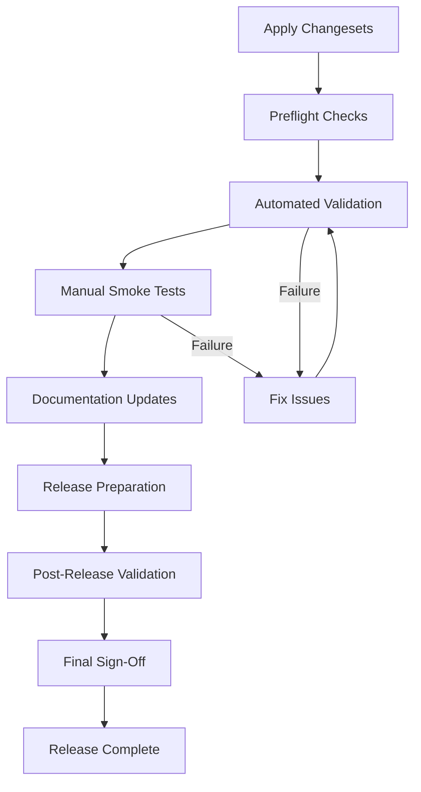

# Release Checklist

<!-- anchor: release-checklist -->

**Document Version**: 1.1.0 **Last Updated**: 2026-02-23 **Part of**: Task
I4.T5 - Release Packaging & Checklist

---

<!-- START doctoc generated TOC please keep comment here to allow auto update -->
<!-- DON'T EDIT THIS SECTION, INSTEAD RE-RUN doctoc TO UPDATE -->

- [Overview](#overview)
- [Release Workflow Summary](#release-workflow-summary)
- [Section 1: Preflight Checks](#section-1-preflight-checks)
  - [1.1 Repository Status](#11-repository-status)
  - [1.2 Environment Requirements](#12-environment-requirements)
  - [1.3 Credentials & Secrets](#13-credentials--secrets)
  - [1.4 Version Consistency](#14-version-consistency)
  - [Preflight Sign-Off](#preflight-sign-off)
- [Section 2: Automated Validation](#section-2-automated-validation)
  - [2.1 Run Release Check Pipeline](#21-run-release-check-pipeline)
  - [2.2 CI Workflow Dry-Run](#22-ci-workflow-dry-run)
  - [2.3 Capture Validation Artifacts](#23-capture-validation-artifacts)
  - [Automated Validation Sign-Off](#automated-validation-sign-off)
- [Section 3: Manual Smoke Tests](#section-3-manual-smoke-tests)
  - [3.1 Test Matrix Definition](#31-test-matrix-definition)
  - [3.2 Install Workflow Test](#32-install-workflow-test)
  - [3.3 Update Workflow Test](#33-update-workflow-test)
  - [3.4 Publish Workflow Test](#34-publish-workflow-test)
  - [3.5 Rollback Workflow Test](#35-rollback-workflow-test)
  - [3.6 Uninstall Workflow Test](#36-uninstall-workflow-test)
  - [3.7 Performance Validation](#37-performance-validation)
  - [Smoke Test Sign-Off](#smoke-test-sign-off)
- [Section 4: Documentation Updates](#section-4-documentation-updates)
  - [4.1 CHANGELOG.md](#41-changelogmd)
  - [4.2 README.md](#42-readmemd)
  - [4.3 Feature Flag Documentation](#43-feature-flag-documentation)
  - [4.4 Traceability Matrix](#44-traceability-matrix)
  - [4.5 API Documentation](#45-api-documentation)
  - [Documentation Updates Sign-Off](#documentation-updates-sign-off)
- [Section 5: Release Preparation](#section-5-release-preparation)
  - [5.1 Create Release Tag](#51-create-release-tag)
  - [5.2 Push Tag to Trigger Workflow](#52-push-tag-to-trigger-workflow)
  - [5.3 Monitor Workflow Execution](#53-monitor-workflow-execution)
  - [5.4 Verify Release Artifacts](#54-verify-release-artifacts)
  - [Release Preparation Sign-Off](#release-preparation-sign-off)
- [Section 6: Post-Release Validation](#section-6-post-release-validation)
  - [6.1 Verify GitHub Release](#61-verify-github-release)
  - [6.2 Test Release Artifacts](#62-test-release-artifacts)
  - [6.3 NPM Publication Verification (if applicable)](#63-npm-publication-verification-if-applicable)
  - [6.4 Announcement & Communication](#64-announcement--communication)
  - [Post-Release Validation Sign-Off](#post-release-validation-sign-off)
- [Section 7: Final Sign-Off](#section-7-final-sign-off)
  - [Release Metadata](#release-metadata)
  - [Approvals](#approvals)
  - [Known Issues & Open Items](#known-issues--open-items)
- [Appendix A: Section 4 Directives Reference](#appendix-a-section-4-directives-reference)
- [Appendix B: Troubleshooting Guide](#appendix-b-troubleshooting-guide)
  - [Validation Failures](#validation-failures)
  - [Workflow Failures](#workflow-failures)
  - [Artifact Issues](#artifact-issues)
- [Appendix C: Rollback Procedure](#appendix-c-rollback-procedure)

<!-- END doctoc generated TOC please keep comment here to allow auto update -->

---

## Overview

This checklist ensures all Yellow Plugins releases meet quality, security, and
documentation standards defined in Section 4 directives and Iteration 4 exit
criteria.

**Purpose**: Gate releases with structured validation steps, capturing evidence
and sign-offs at each stage.

**Scope**: Covers all release types (stable, pre-release, patch) and includes
mandatory smoke tests across macOS, Linux, and WSL platforms.

**Authority**: No release may proceed without completing all sections and
obtaining final sign-off.

---

## Release Workflow Summary



**Phase 0 — Apply Changesets** (run before Preflight Checks):

```sh
# 1. Apply pending changesets (bumps plugin package.json files)
pnpm apply:changesets
# 2. Regenerate lockfile
pnpm install
# 3. Commit version bumps
gt modify -c -m "chore(release): version packages"
# 4. Bump catalog version
node scripts/catalog-version.js minor   # or patch / major
# 5. Commit catalog bump
gt modify -c -m "chore(release): bump catalog to vX.Y.Z"
# 6. Run pre-flight checks
pnpm release:check
# 7. Create and push the release tag — see Section 5 (annotated tag step)
```

See `docs/operations/versioning.md` for the complete developer workflow and
semver bump rules.

**Estimated Duration**: 2-4 hours (excluding fix cycles)

---

## Section 1: Preflight Checks

### 1.1 Repository Status

**Objective**: Ensure clean working state and correct branch.

- [ ] Working directory is clean (no uncommitted changes)

  ```bash
  git status
  # Expected: "nothing to commit, working tree clean"
  ```

- [ ] Current branch is `main` or designated release branch

  ```bash
  git branch --show-current
  ```

- [ ] Local branch is up-to-date with remote

  ```bash
  git fetch origin
  git status
  # Expected: "Your branch is up to date with 'origin/main'"
  ```

- [ ] All CI checks on latest commit are passing
  ```bash
  gh run list --limit 1 --branch main
  # Expected: "completed" status with "success" conclusion
  ```

**Reference**: Section 4 directive - Repository state must be clean before
tagging.

---

### 1.2 Environment Requirements

**Objective**: Verify tooling versions match project requirements.

- [ ] Node.js version: 18-24 LTS

  ```bash
  node --version
  # Expected: v18.x.x, v20.x.x, or v22.x.x
  ```

- [ ] pnpm version: 8.15.0 or higher

  ```bash
  pnpm --version
  # Expected: 8.15.0 or higher
  ```

- [ ] Git version: 2.30 or higher

  ```bash
  git --version
  # Expected: git version 2.30+
  ```

- [ ] GitHub CLI (gh) is installed and authenticated
  ```bash
  gh auth status
  # Expected: "Logged in to github.com as <username>"
  ```

**Reference**: `package.json` engines field,
`.github/workflows/publish-release.yml` env vars.

---

### 1.3 Credentials & Secrets

**Objective**: Confirm required secrets are configured for automated workflows.

- [ ] GitHub Personal Access Token has `contents: write` permission
  - Check repository settings → Actions → General → Workflow permissions

- [ ] NPM_TOKEN secret is configured (if publishing to npm)

  ```bash
  gh secret list | grep NPM_TOKEN
  # Optional: Only required for npm publishing
  ```

- [ ] SSH keys or HTTPS credentials are configured for git operations
  ```bash
  ssh -T git@github.com
  # Expected: "Hi <username>! You've successfully authenticated..."
  ```

**Reference**: `.github/workflows/publish-release.yml` permissions block,
Section 4 security directives.

---

### 1.4 Version Consistency

**Objective**: Ensure version numbers are consistent across all artifacts.

- [ ] All pending changesets have been applied

  ```bash
  pnpm apply:changesets
  # Bumps plugins/*/package.json, syncs plugin.json + marketplace.json
  # Run: pnpm install after (lockfile changes)
  ```

- [ ] Three-way version consistency check passes (package.json == plugin.json == marketplace.json)

  ```bash
  pnpm validate:versions
  # Expected: "[validate-versions] OK: 11 plugins — all versions in sync"
  ```

- [ ] Root `package.json` catalog version updated for this release

  ```bash
  node scripts/catalog-version.js minor   # or patch / major
  node -p "require('./package.json').version"
  # Expected: X.Y.Z matching intended release
  ```

- [ ] Root `CHANGELOG.md` contains catalog entry for this version with today's date

  ```bash
  grep -A 1 "## \[$(node -p 'require("./package.json").version')\]" CHANGELOG.md
  # Expected: ## [X.Y.Z] - YYYY-MM-DD
  ```

- [ ] No version conflicts in workspace packages

  ```bash
  pnpm validate:versions:dry
  # Verify all plugin versions are in sync
  ```


**Reference**: `docs/operations/versioning.md`, `.github/workflows/publish-release.yml`
version validation step, `scripts/validate-versions.js`.

---

### Preflight Sign-Off

**Reviewer**: **\*\*\*\***\_\_\_**\*\*\*\*** **Date**:
**\*\*\*\***\_\_\_**\*\*\*\*** **Notes**: **\*\*\*\***\_\_\_**\*\*\*\***

---

## Section 2: Automated Validation

### 2.1 Run Release Check Pipeline

**Objective**: Execute comprehensive validation via `pnpm release:check`.

- [ ] Run release check command

  ```bash
  pnpm release:check
  # Expected: All checks pass with exit code 0
  ```

- [ ] **Linting**: No errors or warnings
  - Command: `pnpm lint`
  - Expected: ✅ All files pass ESLint rules (max warnings: 0)

- [ ] **Type Checking**: No type errors
  - Command: `pnpm typecheck`
  - Expected: ✅ TypeScript compilation succeeds across all packages

- [ ] **Unit Tests**: All tests pass
  - Command: `pnpm test:unit`
  - Expected: ✅ 100% pass rate, coverage ≥ target

- [ ] **Integration Tests**: All tests pass
  - Command: `pnpm test:integration`
  - Expected: ✅ 100% pass rate

- [ ] **Schema Validation**: Schemas valid and examples pass
  - Command: `pnpm validate:schemas`
  - Expected: ✅ 10 marketplace rules + 12 plugin rules all pass

- [ ] **Documentation Linting**: Markdown and TOCs are valid
  - Command: `pnpm docs:lint`
  - Expected: ✅ doctoc + markdownlint report no errors

**Reference**: Section 4 directive - Validation job must complete in < 60
seconds median.

---

### 2.2 CI Workflow Dry-Run

**Objective**: Simulate release workflow without actually publishing.

- [ ] Trigger workflow dry-run using workflow_dispatch

  ```bash
  gh workflow run publish-release.yml \
    --field version="$(node -p "require('./package.json').version")" \
    --field prerelease="false"
  ```

- [ ] Monitor workflow execution

  ```bash
  gh run watch
  # Wait for completion, verify all jobs succeed
  ```

- [ ] Review workflow summary
  ```bash
  gh run view --log
  # Confirm validation, build, artifact generation steps all green
  ```

**Reference**: `.github/workflows/publish-release.yml`, Iteration 4 validation
focus.

---

### 2.3 Capture Validation Artifacts

**Objective**: Archive validation outputs for audit trail.

- [ ] Save release:check output

  ```bash
  pnpm release:check > release-validation-$(date +%Y%m%d-%H%M%S).log 2>&1
  ```

- [ ] Export test coverage report

  ```bash
  pnpm test:unit --coverage
  # Save coverage/ directory to artifacts
  ```

- [ ] Export metrics snapshot (if telemetry enabled)

  ```bash
  # Future: pnpm metrics:export --format=json > release-metrics.json
  echo "Metrics export not yet implemented" > release-metrics.json
  ```

- [ ] Archive artifacts in `.ci-artifacts/releases/vX.Y.Z/`
  ```bash
  mkdir -p .ci-artifacts/releases/v$(node -p "require('./package.json').version")
  mv release-*.log .ci-artifacts/releases/v$(node -p "require('./package.json').version")/
  ```

**Reference**: Section 4 directive - CI artifacts must be archived, Section 6
metrics/observability.

---

### Automated Validation Sign-Off

**Reviewer**: **\*\*\*\***\_\_\_**\*\*\*\*** **Date**:
**\*\*\*\***\_\_\_**\*\*\*\*** **Artifact Path**:
`.ci-artifacts/releases/vX.Y.Z/` **Notes**: **\*\*\*\***\_\_\_**\*\*\*\***

---

## Section 3: Manual Smoke Tests

### 3.1 Test Matrix Definition

**Objective**: Define platforms and configurations for smoke testing.

Test on **all** of the following platforms (macOS + Linux + WSL) to comply with
Iteration 4 acceptance criteria and FR-011/NFR-PERF guardrails:

- [ ] **macOS** (Darwin arm64 or x64)
  - Node.js version: **\*\*\*\***\_\_\_**\*\*\*\***
  - Shell: zsh/bash

- [ ] **Linux** (Ubuntu 20.04+ or Debian-based)
  - Node.js version: **\*\*\*\***\_\_\_**\*\*\*\***
  - Shell: bash

- [ ] **WSL** (Windows Subsystem for Linux)
  - Node.js version: **\*\*\*\***\_\_\_**\*\*\*\***
  - Distribution: **\*\*\*\***\_\_\_**\*\*\*\***

**Smoke Test Report Template**

| Platform | Install     | Update      | Publish     | Rollback    | Uninstall   | Evidence Path                  | Notes                          |
| -------- | ----------- | ----------- | ----------- | ----------- | ----------- | ------------------------------ | ------------------------------ |
| macOS    | PASS / FAIL | PASS / FAIL | PASS / FAIL | PASS / FAIL | PASS / FAIL | **\*\*\*\***\_\_\_**\*\*\*\*** | **\*\*\*\***\_\_\_**\*\*\*\*** |
| Linux    | PASS / FAIL | PASS / FAIL | PASS / FAIL | PASS / FAIL | PASS / FAIL | **\*\*\*\***\_\_\_**\*\*\*\*** | **\*\*\*\***\_\_\_**\*\*\*\*** |
| WSL      | PASS / FAIL | PASS / FAIL | PASS / FAIL | PASS / FAIL | PASS / FAIL | **\*\*\*\***\_\_\_**\*\*\*\*** | **\*\*\*\***\_\_\_**\*\*\*\*** |

**Reference**: Iteration 4 acceptance criteria - Smoke tests per matrix
(macOS/Linux/WSL).

---

### 3.2 Install Workflow Test

**Objective**: Validate end-to-end plugin installation.

**Prerequisites**: Sample plugin repository or test fixture available.

- [ ] Run install command

  ```bash
  pnpm cli install <sample-plugin-id>
  ```

- [ ] Verify installation success message
  - Expected: "✓ Plugin <id> installed successfully"

- [ ] Confirm plugin appears in installed list

  ```bash
  pnpm cli list
  # Expected: <sample-plugin-id> listed with version
  ```

- [ ] Verify `.claude-plugin/cache/` contains downloaded artifacts

  ```bash
  ls -lh .claude-plugin/cache/
  ```

- [ ] Check registry entries created

  ```bash
  cat .claude-plugin/registry.json
  # Expected: Entry for <sample-plugin-id> with metadata
  ```

- [ ] Verify symlink created in install directory

  ```bash
  ls -l .claude/plugins/<sample-plugin-id>
  # Expected: Symlink pointing to cache
  ```

- [ ] Check install duration (must be ≤ 2 minutes)
  - Recorded duration: **\*\*\*\***\_\_\_**\*\*\*\***

**Reference**: FR-004, NFR-PERF-001 (PSM), Section 2.2.1 install journey.

---

### 3.3 Update Workflow Test

**Objective**: Validate plugin update with changelog awareness.

**Prerequisites**: Plugin installed from previous test, newer version available.

- [ ] Run update command

  ```bash
  pnpm cli update <sample-plugin-id>
  ```

- [ ] Verify changelog display (if available)
  - Expected: Changelog excerpt shown before update

- [ ] Confirm update success message
  - Expected: "✓ Plugin <id> updated to vX.Y.Z"

- [ ] Verify registry updated with new version

  ```bash
  cat .claude-plugin/registry.json | jq '.plugins[] | select(.id=="<sample-plugin-id>")'
  ```

- [ ] Confirm previous version cached (for rollback)
  ```bash
  ls -lh .claude-plugin/cache/<sample-plugin-id>/
  # Expected: Multiple version directories
  ```

**Reference**: FR-008, Section 2.2.2 update journey.

---

### 3.4 Publish Workflow Test

**Objective**: Validate publish command with git integration (dry-run).

**Prerequisites**: Test plugin repository with valid `plugin.json`.

- [ ] Run publish command in dry-run mode

  ```bash
  pnpm cli publish --dry-run
  # Expected: Validation passes, no actual git operations
  ```

- [ ] Verify validation steps execute
  - Schema validation
  - Compatibility checks
  - Required field verification

- [ ] Confirm dry-run output shows intended operations
  - Expected: "Would create tag vX.Y.Z", "Would push to remote", etc.

- [ ] Check publish duration estimate (target: ≤ 10 minutes)
  - Estimated duration: **\*\*\*\***\_\_\_**\*\*\*\***

**Reference**: FR-009, FR-011, NFR-PERF-003, Section 2.2.7 publish journey.

---

### 3.5 Rollback Workflow Test

**Objective**: Validate instant rollback via symlink swap.

**Prerequisites**: Plugin with multiple versions installed (from update test).

- [ ] Note current plugin version

  ```bash
  pnpm cli list | grep <sample-plugin-id>
  ```

- [ ] Run rollback command

  ```bash
  pnpm cli rollback <sample-plugin-id>
  ```

- [ ] Verify rollback success message
  - Expected: "✓ Plugin <id> rolled back to vX.Y.Z"

- [ ] Confirm registry reflects previous version

  ```bash
  cat .claude-plugin/registry.json | jq '.plugins[] | select(.id=="<sample-plugin-id>") | .version'
  ```

- [ ] Check rollback duration (must be < 1 second)
  - Recorded duration: **\*\*\*\***\_\_\_**\*\*\*\***

- [ ] Verify no manual cleanup required
  - Expected: All state changes handled by CLI

**Reference**: FR-007, NFR-PERF-005, SSM-1 (100% rollback success), Section
2.2.3 rollback journey.

---

### 3.6 Uninstall Workflow Test

**Objective**: Validate complete plugin removal with lifecycle hooks.

**Prerequisites**: Plugin installed (from previous tests).

- [ ] Run uninstall command

  ```bash
  pnpm cli uninstall <sample-plugin-id>
  ```

- [ ] Verify uninstall success message
  - Expected: "✓ Plugin <id> uninstalled successfully"

- [ ] Confirm plugin removed from registry

  ```bash
  cat .claude-plugin/registry.json | jq '.plugins[] | select(.id=="<sample-plugin-id>")'
  # Expected: No output (entry removed)
  ```

- [ ] Verify symlink removed from install directory

  ```bash
  ls .claude/plugins/<sample-plugin-id>
  # Expected: No such file or directory
  ```

- [ ] Check cache artifacts retained (for reinstall performance)
  ```bash
  ls -lh .claude-plugin/cache/<sample-plugin-id>/
  # Expected: Cached versions still present
  ```

**Reference**: FR-012, Section 2.2.10 uninstall journey,
docs/operations/uninstall.md.

---

### 3.7 Performance Validation

**Objective**: Confirm performance metrics meet NFR targets.

- [ ] **Install Duration**: Average ≤ 2 minutes (p95)
  - Recorded samples: **\*\*\*\***\_\_\_**\*\*\*\***
  - Average: **\*\*\*\***\_\_\_**\*\*\*\***
  - p95: **\*\*\*\***\_\_\_**\*\*\*\***

- [ ] **Rollback Duration**: < 1 second
  - Recorded samples: **\*\*\*\***\_\_\_**\*\*\*\***
  - Max: **\*\*\*\***\_\_\_**\*\*\*\***

- [ ] **Cache Size**: Monitor eviction at 500MB threshold

  ```bash
  du -sh .claude-plugin/cache/
  # Expected: Size managed within configured limit
  ```

- [ ] **CI Validation Job**: < 60 seconds (from automated validation)
  - Recorded duration: **\*\*\*\***\_\_\_**\*\*\*\***

**Reference**: NFR-PERF-001, NFR-PERF-002, NFR-PERF-005, Iteration 4 metrics
targets.

---

### Smoke Test Sign-Off

**Reviewer**: **\*\*\*\***\_\_\_**\*\*\*\*** **Date**:
**\*\*\*\***\_\_\_**\*\*\*\*** **Platforms Tested**: ☐ macOS ☐ Linux ☐ WSL
**Test Evidence Path**: `.ci-artifacts/releases/vX.Y.Z/smoke-tests/` **Notes**:
**\*\*\*\***\_\_\_**\*\*\*\***

---

## Section 4: Documentation Updates

### 4.1 CHANGELOG.md

**Objective**: Ensure changelog entry is complete and traceable.

- [ ] Version heading follows format: `## [X.Y.Z] - YYYY-MM-DD`
- [ ] All functional changes cited with FR/NFR/CRIT identifiers
- [ ] Feature flag states documented with defaults and rationale
- [ ] Performance metrics included with actual vs. target values
- [ ] Known limitations transparently disclosed
- [ ] Related ADR references included (if applicable)
- [ ] Entry extractable by GitHub Actions workflow
  ```bash
  VERSION=$(node -p "require('./package.json').version")
  awk "/## \[?$VERSION\]?/,/## \[?[0-9]/" CHANGELOG.md | head -n -1
  # Expected: Clean extraction of release notes
  ```

**Reference**: `.github/workflows/publish-release.yml` changelog extraction,
Section 4 traceability enforcement.

---

### 4.2 README.md

**Objective**: Update README with release information and feature flags.

- [ ] Version badge updated (if present)
- [ ] Release section added/updated with:
  - Prerequisites (Node.js, pnpm, git)
  - `pnpm release:check` command documentation
  - Link to release checklist
  - Link to `.github/releases.md` runbook
- [ ] Feature flag table added with:
  - Flag name
  - Default state
  - Related FR/NFR
  - Release decision (enabled/disabled and why)
  - Owning ADR (if applicable)
- [ ] Quick navigation links updated for new docs

**Reference**: Task I4.T5 deliverables, Section 4 feature flag governance.

---

### 4.3 Feature Flag Documentation

**Objective**: Synchronize feature flag states across all documentation.

- [ ] `.claude-plugin/flags.json` reflects production defaults
- [ ] `docs/operations/feature-flags.md` table matches `flags.json`
- [ ] README.md feature flag table matches operational docs
- [ ] Release notes cite flag states with requirement references
- [ ] Any flag state changes since last release are justified in:
  - CHANGELOG.md under relevant version
  - Corresponding ADR (if architectural impact)

**Reference**: Section 4 feature flag governance,
`docs/operations/feature-flags.md`.

---

### 4.4 Traceability Matrix

**Objective**: Update traceability matrix with new documentation artifacts.

- [ ] Add entries for release documentation:
  - `CHANGELOG.md` → FR-011 (release automation), all FRs/NFRs implemented
  - `docs/operations/release-checklist.md` → FR-011, Section 4 directives
  - `.github/releases.md` → FR-011, operational processes
  - README.md updates → FR-001..FR-013 (user-facing feature summary)
- [ ] Verify 100% traceability maintained
- [ ] Run doctoc to update table of contents
  ```bash
  pnpm docs:lint:toc
  ```

---

### 4.5 API Documentation

**Objective**: Regenerate API docs if code changes occurred.

- [ ] Run typedoc to regenerate API documentation

  ```bash
  pnpm docs:build
  # Expected: typedoc generates updated API docs
  ```

- [ ] Verify API docs reflect current interfaces and types
- [ ] Check for broken links in generated docs
  ```bash
  # Manual review or link checker if available
  ```

**Reference**: Section 4 documentation synchronization directive.

---

### Documentation Updates Sign-Off

**Reviewer**: **\*\*\*\***\_\_\_**\*\*\*\*** **Date**:
**\*\*\*\***\_\_\_**\*\*\*\*** **Doctoc Run**: ☐ Yes ☐ No (not needed)
**Notes**: **\*\*\*\***\_\_\_**\*\*\*\***

---

## Section 5: Release Preparation

### 5.1 Create Release Tag

**Objective**: Tag the release commit following semantic versioning.

- [ ] Verify current commit is the intended release commit

  ```bash
  git log --oneline -1
  ```

- [ ] Create annotated tag with release notes

  ```bash
  VERSION=$(node -p "require('./package.json').version")
  git tag -a "v$VERSION" -m "Release v$VERSION

  $(awk "/## \[?$VERSION\]?/,/## \[?[0-9]/" CHANGELOG.md | head -n -1)

  Co-Authored-By: Claude Sonnet 4.5 <noreply@anthropic.com>
  "
  ```

- [ ] Verify tag created locally
  ```bash
  git tag -l | grep "v$VERSION"
  ```

**Reference**: `.github/workflows/publish-release.yml` tag trigger pattern,
Section 4 git tagging conventions.

---

### 5.2 Push Tag to Trigger Workflow

**Objective**: Push tag to GitHub to trigger automated release workflow.

- [ ] Push tag to remote

  ```bash
  git push origin "v$(node -p "require('./package.json').version")"
  ```

- [ ] Confirm tag appears on GitHub
  ```bash
  gh api repos/:owner/:repo/git/refs/tags | jq '.[] | select(.ref | contains("v$(node -p "require('./package.json').version"))"))'
  ```

**Reference**: `.github/workflows/publish-release.yml` on.push.tags trigger.

---

### 5.3 Monitor Workflow Execution

**Objective**: Watch automated workflow and intervene if failures occur.

- [ ] Monitor workflow run in real-time

  ```bash
  gh run watch
  ```

- [ ] Verify all jobs complete successfully:
  - [ ] validate-release
  - [ ] build-artifacts
  - [ ] publish-release
  - [ ] publish-npm (if applicable)
  - [ ] notify

- [ ] Check workflow summary for warnings or notices
  ```bash
  gh run view --log
  ```

**Reference**: `.github/workflows/publish-release.yml` job dependencies and
outputs.

---

### 5.4 Verify Release Artifacts

**Objective**: Confirm all expected artifacts were generated and uploaded.

- [ ] Download release artifacts

  ```bash
  VERSION=$(node -p "require('./package.json').version")
  gh run download $(gh run list --workflow=publish-release.yml --limit 1 --json databaseId -q '.[0].databaseId')
  ```

- [ ] Verify artifact contents:
  - [ ] `dist-release/yellow-plugins-vX.Y.Z.tar.gz` (source tarball)
  - [ ] `dist-release/sbom.json` (dependency tree)
  - [ ] `dist-release/dependencies.txt` (human-readable deps)
  - [ ] `dist-release/SHA256SUMS.txt` (checksums)
  - [ ] `release-notes.md` (extracted changelog)

- [ ] Validate checksums
  ```bash
  cd release-artifacts-v*/dist-release/
  sha256sum -c SHA256SUMS.txt
  # Expected: All files OK
  ```

**Reference**: `.github/workflows/publish-release.yml` build-artifacts job,
Section 4 audit requirements.

---

### Release Preparation Sign-Off

**Reviewer**: **\*\*\*\***\_\_\_**\*\*\*\*** **Date**:
**\*\*\*\***\_\_\_**\*\*\*\*** **Tag**: v**\*\*\*\***\_\_\_**\*\*\*\***
**Workflow Run ID**: **\*\*\*\***\_\_\_**\*\*\*\*** **Notes**:
**\*\*\*\***\_\_\_**\*\*\*\***

---

## Section 6: Post-Release Validation

### 6.1 Verify GitHub Release

**Objective**: Confirm GitHub Release was created with correct metadata.

- [ ] Navigate to GitHub Releases page

  ```bash
  VERSION=$(node -p "require('./package.json').version")
  gh release view "v$VERSION"
  ```

- [ ] Verify release details:
  - [ ] Title: "Release vX.Y.Z"
  - [ ] Tag: vX.Y.Z
  - [ ] Release notes extracted from CHANGELOG.md
  - [ ] Pre-release flag set correctly (if applicable)
  - [ ] Release assets attached (tarball, SBOM, checksums)

- [ ] Check release URL
  ```bash
  gh release view "v$VERSION" --json url -q '.url'
  ```

**Reference**: `.github/workflows/publish-release.yml` publish-release job,
softprops/action-gh-release.

---

### 6.2 Test Release Artifacts

**Objective**: Download and verify release artifacts work as expected.

- [ ] Download tarball from GitHub Release

  ```bash
  VERSION=$(node -p "require('./package.json').version")
  gh release download "v$VERSION" --pattern "yellow-plugins-v$VERSION.tar.gz"
  ```

- [ ] Extract and verify contents

  ```bash
  tar -tzf "yellow-plugins-v$VERSION.tar.gz" | head -20
  # Expected: Project files excluding node_modules, .git, etc.
  ```

- [ ] Verify SBOM integrity
  ```bash
  gh release download "v$VERSION" --pattern "sbom.json"
  jq '.length' sbom.json
  # Expected: Non-zero dependency count
  ```

**Reference**: `.github/workflows/publish-release.yml` tarball creation step.

---

### 6.3 NPM Publication Verification (if applicable)

**Objective**: Confirm packages published to npm registry (stable releases
only).

**Note**: Skip this section if NPM_TOKEN is not configured or release is a
pre-release.

- [ ] Check npm registry for published packages

  ```bash
  npm view @yellow-plugins/cli version
  npm view @yellow-plugins/domain version
  npm view @yellow-plugins/infrastructure version
  # Expected: All show vX.Y.Z matching release version
  ```

- [ ] Verify package metadata

  ```bash
  npm view @yellow-plugins/cli
  # Expected: Correct description, repository, keywords
  ```

- [ ] Test installation from npm
  ```bash
  npm install @yellow-plugins/cli@$(node -p "require('./package.json').version")
  # Expected: Successful installation
  ```

**Reference**: `.github/workflows/publish-release.yml` publish-npm job,
package.json repository field.

---

### 6.4 Announcement & Communication

**Objective**: Notify stakeholders and update project status.

- [ ] Update project README.md "Implementation Status" section (if needed)
- [ ] Announce release in project communication channels:
  - [ ] GitHub Discussions (if enabled)
  - [ ] Project blog/changelog feed (if applicable)
  - [ ] Social media/forums (if applicable)
- [ ] Update external documentation sites (if any)
- [ ] Notify collaborators/maintainers

**Reference**: Iteration 4 knowledge transfer, operational readiness reviews.

---

### Post-Release Validation Sign-Off

**Reviewer**: **\*\*\*\***\_\_\_**\*\*\*\*** **Date**:
**\*\*\*\***\_\_\_**\*\*\*\*** **Release URL**: **\*\*\*\***\_\_\_**\*\*\*\***
**NPM Published**: ☐ Yes ☐ No ☐ N/A **Notes**: **\*\*\*\***\_\_\_**\*\*\*\***

---

## Section 7: Final Sign-Off

### Release Metadata

| Field                  | Value                           |
| ---------------------- | ------------------------------- |
| **Release Version**    | v**\*\*\*\***\_\_\_**\*\*\*\*** |
| **Release Date**       | **\*\*\*\***\_\_\_**\*\*\*\***  |
| **Git Commit SHA**     | **\*\*\*\***\_\_\_**\*\*\*\***  |
| **Git Tag**            | v**\*\*\*\***\_\_\_**\*\*\*\*** |
| **GitHub Release URL** | **\*\*\*\***\_\_\_**\*\*\*\***  |
| **Workflow Run ID**    | **\*\*\*\***\_\_\_**\*\*\*\***  |
| **NPM Published**      | ☐ Yes ☐ No ☐ N/A                |

---

### Approvals

All sections completed and signed off:

- [ ] **Section 1: Preflight Checks** - Signed by:
      **\*\*\*\***\_\_\_**\*\*\*\*** on **\*\*\*\***\_\_\_**\*\*\*\***
- [ ] **Section 2: Automated Validation** - Signed by:
      **\*\*\*\***\_\_\_**\*\*\*\*** on **\*\*\*\***\_\_\_**\*\*\*\***
- [ ] **Section 3: Manual Smoke Tests** - Signed by:
      **\*\*\*\***\_\_\_**\*\*\*\*** on **\*\*\*\***\_\_\_**\*\*\*\***
- [ ] **Section 4: Documentation Updates** - Signed by:
      **\*\*\*\***\_\_\_**\*\*\*\*** on **\*\*\*\***\_\_\_**\*\*\*\***
- [ ] **Section 5: Release Preparation** - Signed by:
      **\*\*\*\***\_\_\_**\*\*\*\*** on **\*\*\*\***\_\_\_**\*\*\*\***
- [ ] **Section 6: Post-Release Validation** - Signed by:
      **\*\*\*\***\_\_\_**\*\*\*\*** on **\*\*\*\***\_\_\_**\*\*\*\***

---

### Known Issues & Open Items

Document any issues discovered during release or deferred to next version:

| Issue ID | Description | Severity | Workaround | Planned Fix Version |
| -------- | ----------- | -------- | ---------- | ------------------- |
| \_\_\_   | \_\_\_      | \_\_\_   | \_\_\_     | \_\_\_              |

---

**Final Release Approval**:

**Release Manager**: **\*\*\*\***\_\_\_**\*\*\*\*** **Date**:
**\*\*\*\***\_\_\_**\*\*\*\*** **Signature**: **\*\*\*\***\_\_\_**\*\*\*\***

**Status**: ☐ APPROVED ☐ REJECTED

**Notes**:

---

---

---

---

## Appendix A: Section 4 Directives Reference

This checklist enforces the following Section 4 directives:

1. **Feature-Flag Governance**: Flags documented with ownership, defaults
   verified (Section 4.2)
2. **Traceability Enforcement**: All changes reference FR/NFR/CRIT IDs (Section
   4.3)
3. **Atomic Persistence**: Registry/cache writes use transaction IDs (Section
   4.4)
4. **Security & Observability**: Lifecycle scripts require consent, logs
   structured (Section 4.5)
5. **Performance Budgets**: Install ≤ 2min, publish ≤ 10min, CI validation < 60s
   (Section 4.6)
6. **Documentation Synchronization**: typedoc/doctoc/markdownlint run in CI
   (Section 4.7)

---

## Appendix B: Troubleshooting Guide

### Validation Failures

**Problem**: `pnpm release:check` fails

**Solutions**:

1. Review specific failing step (lint/typecheck/test/docs)
2. Run individual commands to isolate issue
3. Check `.eslintrc.cjs`, `tsconfig.json`, test configs for misconfigurations
4. Review recent commits for breaking changes

**Problem**: Schema validation fails

**Solutions**:

1. Validate example files against schemas manually
   ```bash
   node scripts/validate-marketplace.js
   node scripts/validate-plugin.js
   ```
2. Check for schema syntax errors using JSON Schema validators
3. Ensure all required fields present in example files

---

### Workflow Failures

**Problem**: GitHub Actions workflow fails on validate-release job

**Solutions**:

1. Check workflow logs for specific error
   ```bash
   gh run view --log
   ```
2. Verify version consistency (package.json vs. tag vs. CHANGELOG)
3. Ensure dependencies installed with frozen lockfile
4. Reproduce locally with same Node/pnpm versions

**Problem**: Tarball creation fails

**Solutions**:

1. Check disk space on runner
2. Verify exclude patterns in tar command
3. Ensure no circular symlinks in project

---

### Artifact Issues

**Problem**: Release artifacts not uploaded

**Solutions**:

1. Check artifact retention policy (90 days default)
2. Verify workflow permissions (contents: write)
3. Review upload-artifact action logs

**Problem**: Checksum verification fails

**Solutions**:

1. Re-download artifacts
2. Check for network corruption during download
3. Regenerate checksums and compare manually

---

## Appendix C: Rollback Procedure

**If a release must be rolled back post-publication:**

1. **Mark release as draft** (hides from users)

   ```bash
   gh release edit vX.Y.Z --draft
   ```

2. **Delete tag** (prevents confusion)

   ```bash
   git tag -d vX.Y.Z
   git push origin :refs/tags/vX.Y.Z
   ```

3. **Unpublish from npm** (if published, within 72 hours only)

   ```bash
   npm unpublish @yellow-plugins/cli@X.Y.Z
   npm unpublish @yellow-plugins/domain@X.Y.Z
   npm unpublish @yellow-plugins/infrastructure@X.Y.Z
   ```

4. **Document incident**
   - Create postmortem using `docs/operations/postmortem-template.md`
   - Update CHANGELOG.md with "## [X.Y.Z] - YANKED" entry
   - Open GitHub issue explaining rollback reason

5. **Issue patch release**
   - Fix issue causing rollback
   - Increment version (X.Y.Z+1)
   - Run full checklist again

**Reference**: `docs/operations/postmortem-template.md`, Section 4 incident
response.

---

**End of Release Checklist**

**Document Maintenance**: This checklist should be updated whenever release
procedures change. Increment document version and update Last Updated date.

**Feedback**: Submit improvements via GitHub Issues or pull requests.

**Related Documents**:

- `.github/releases.md` - Release workflow runbook
- `CHANGELOG.md` - Historical release notes
- `docs/operations/runbook.md` - Operational procedures
- `docs/operations/ci.md` - CI/CD architecture

---

**Last Updated**: 2026-02-23 **Document Version**: 1.1.0 **Maintained By**:
KingInYellows
