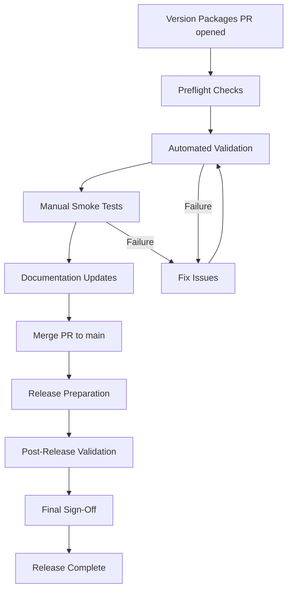

# Release Checklist

<!-- anchor: release-checklist -->

**Document Version**: 1.1.0 **Last Updated**: 2026-02-23 **Part of**: Task
I4.T5 - Release Packaging & Checklist

---

<!-- START doctoc generated TOC please keep comment here to allow auto update -->
<!-- DON'T EDIT THIS SECTION, INSTEAD RE-RUN doctoc TO UPDATE -->

- [Overview](#overview)
- [Release Workflow Summary](#release-workflow-summary)
- [Section 1: Preflight Checks](#section-1-preflight-checks)
  - [1.1 Repository Status](#11-repository-status)
  - [1.2 Environment Requirements](#12-environment-requirements)
  - [1.3 Credentials & Secrets](#13-credentials--secrets)
  - [1.4 Version Consistency](#14-version-consistency)
  - [Preflight Sign-Off](#preflight-sign-off)
- [Section 2: Automated Validation](#section-2-automated-validation)
  - [2.1 Run Release Check Pipeline](#21-run-release-check-pipeline)
  - [2.2 CI Workflow Validation](#22-ci-workflow-validation)
  - [2.3 Capture Validation Artifacts](#23-capture-validation-artifacts)
  - [Automated Validation Sign-Off](#automated-validation-sign-off)
- [Section 3: Manual Smoke Tests](#section-3-manual-smoke-tests)
  - [3.1 Test Matrix Definition](#31-test-matrix-definition)
  - [3.2 Install Workflow Test](#32-install-workflow-test)
  - [3.3 Update Workflow Test](#33-update-workflow-test)
  - [3.4 Publish Workflow Test](#34-publish-workflow-test)
  - [3.5 Rollback Workflow Test](#35-rollback-workflow-test)
  - [3.6 Uninstall Workflow Test](#36-uninstall-workflow-test)
  - [3.7 Performance Validation](#37-performance-validation)
  - [Smoke Test Sign-Off](#smoke-test-sign-off)
- [Section 4: Documentation Updates](#section-4-documentation-updates)
  - [4.1 CHANGELOG.md](#41-changelogmd)
  - [4.2 README.md](#42-readmemd)
  - [4.3 Feature Flag Documentation](#43-feature-flag-documentation)
  - [4.4 Traceability Matrix](#44-traceability-matrix)
  - [4.5 API Documentation](#45-api-documentation)
  - [Documentation Updates Sign-Off](#documentation-updates-sign-off)
- [Section 5: Release Preparation](#section-5-release-preparation)
  - [5.1 Verify Release Readiness](#51-verify-release-readiness)
  - [5.2 Manual Tag Creation (Emergency Recovery Only)](#52-manual-tag-creation-emergency-recovery-only)
  - [5.3 Monitor Workflow Execution](#53-monitor-workflow-execution)
  - [5.4 Verify Release Artifacts](#54-verify-release-artifacts)
  - [Release Preparation Sign-Off](#release-preparation-sign-off)
- [Section 6: Post-Release Validation](#section-6-post-release-validation)
  - [6.1 Verify GitHub Release](#61-verify-github-release)
  - [6.2 Test Release Artifacts](#62-test-release-artifacts)
  - [6.3 Package Registry Publication](#63-package-registry-publication)
  - [6.4 Announcement & Communication](#64-announcement--communication)
  - [Post-Release Validation Sign-Off](#post-release-validation-sign-off)
- [Section 7: Final Sign-Off](#section-7-final-sign-off)
  - [Release Metadata](#release-metadata)
  - [Approvals](#approvals)
  - [Known Issues & Open Items](#known-issues--open-items)
- [Appendix A: Section 4 Directives Reference](#appendix-a-section-4-directives-reference)
- [Appendix B: Troubleshooting Guide](#appendix-b-troubleshooting-guide)
  - [Validation Failures](#validation-failures)
  - [Workflow Failures](#workflow-failures)
  - [Artifact Issues](#artifact-issues)
- [Appendix C: Rollback Procedure](#appendix-c-rollback-procedure)

<!-- END doctoc generated TOC please keep comment here to allow auto update -->

---

## Overview

This checklist ensures all Yellow Plugins releases meet quality, security, and
documentation standards defined in Section 4 directives and Iteration 4 exit
criteria.

**Purpose**: Gate releases with structured validation steps, capturing evidence
and sign-offs at each stage.

**Scope**: Covers all release types (stable, pre-release, patch) and includes
mandatory smoke tests across macOS, Linux, and WSL platforms.

**Authority**: No release may proceed without completing all sections and
obtaining final sign-off — except Section 3.2-3.7, which are non-blocking until
`docs/contracts/cli-contracts.md` is implemented (see the scope note at the top
of Section 3).

---

## Release Workflow Summary


```mermaid
graph TD
    P[Version Packages PR opened] --> A[Preflight Checks]
    A --> B[Automated Validation]
    B --> C[Manual Smoke Tests]
    C --> D[Documentation Updates]
    D --> M[Merge PR to main]
    M --> E[Release Preparation]
    E --> F[Post-Release Validation]
    F --> G[Final Sign-Off]

    B -->|Failure| H[Fix Issues]
    C -->|Failure| H
    H --> B

    G --> I[Release Complete]
```

**Phase 0 — Version Packages PR** (standard automated path):

```sh
# 1. Merge feature PRs to main with their .changeset/*.md files committed.
# 2. version-packages.yml opens or updates the "chore: version packages" PR.
# 3. Review bump types, CHANGELOG entries, and three-way version sync.
# 4. Run Sections 1-4 (Preflight, Automated Validation, Smoke Tests,
#    Documentation Updates) against this PR's branch. Do not merge until
#    all four gates pass — a failed smoke test cannot stop the release
#    once the PR is merged.
# 5. Merge that PR to main. With no pending changesets left, the same
#    workflow's publish phase creates tags and the GitHub Release on this
#    push. Manual tagging is emergency-only — see Section 5.2. Do not push
#    a tag to trigger the workflow.
```

**Emergency manual release** (only when the bot cannot open the Version Packages
PR): see `CONTRIBUTING.md` "Emergency manual release" — the canonical procedure,
including the stale-tag, stale-branch, and `force_publish` overwrite-risk
cautions (not repeated here). Short version: that path runs
`pnpm version-packages` on a hand-made branch, submits it through the enabled
stacked-PR provider, and merges that PR to `main` — it never pushes to `main`
directly. The merge publishes the same way as Phase 0 step 5.

See `docs/operations/versioning.md` for the complete developer workflow and
semver bump rules.

**Estimated Duration**: 2-4 hours (excluding fix cycles)

---

## Section 1: Preflight Checks

> Sections 1-4 run against the release PR branch before it merges: the open
> "chore: version packages" PR on the automated path (Phase 0 above), or your
> hand-made release branch on the emergency path.

### 1.1 Repository Status

**Objective**: Ensure clean working state and correct branch.

- [ ] Working directory is clean (no uncommitted changes)

  ```bash
  git status
  # Expected: "nothing to commit, working tree clean"
  ```

- [ ] Current branch is the Version Packages PR branch (automated path) or
      your emergency release branch

  ```bash
  # Automated path: the bot's PR is titled "chore: version packages"
  gh pr checkout "$(gh pr list --search 'chore: version packages' --json number -q '.[0].number')"
  # Emergency path: check out your own release branch instead
  #   gt checkout <branch>   (Graphite)  |  git switch <branch>   (GitHub)
  git branch --show-current
  ```

- [ ] Local branch is up-to-date with its remote branch

  ```bash
  git fetch origin
  git status
  # Expected: "Your branch is up to date with 'origin/<that branch>'"
  ```

- [ ] Record the branch head SHA now — the bot force-pushes the same "chore:
      version packages" PR whenever a new changeset lands on `main`, and this
      checklist runs 2-4 hours. A gate passed against one SHA does not attest to
      a later one.

  ```bash
  git rev-parse HEAD
  # Record this value. Immediately before merging (end of Phase 0 step 5),
  # `git fetch origin && git rev-parse origin/<branch>` and compare — if it
  # moved, the PR changed underneath you: re-run Sections 1-4 against the new
  # head before merging.
  ```

- [ ] `main` CI is green, and the branch passes the Section 2 local run
  ```bash
  gh run list --limit 1 --branch main --workflow validate-schemas.yml
  # Expected: "completed" status with "success" conclusion
  ```

  `validate-schemas.yml` does not run on the bot-created Version Packages PR
  (see `CONTRIBUTING.md` "Reviewing the Version Packages PR"), so there is no
  PR CI run to check — Section 2's `pnpm release:check` is the branch gate.

**Reference**: Section 4 directive - Repository state must be clean before
tagging.

---

### 1.2 Environment Requirements

**Objective**: Verify tooling versions match project requirements.

- [ ] Node.js version: 22.22.0-24.x

  ```bash
  node --version
  # Expected: >= v22.22.0 and < v25.0.0
  ```

- [ ] pnpm version: 8.15.0 or higher

  ```bash
  pnpm --version
  # Expected: 8.15.0 or higher
  ```

- [ ] Git version: 2.30 or higher

  ```bash
  git --version
  # Expected: git version 2.30+
  ```

- [ ] GitHub CLI (gh) is installed and authenticated
  ```bash
  gh auth status
  # Expected: "Logged in to github.com as <username>"
  ```

**Reference**: `package.json` engines field,
`.github/workflows/version-packages.yml` env vars.

---

### 1.3 Credentials & Secrets

**Objective**: Confirm required secrets are configured for automated workflows.

- [ ] GitHub Personal Access Token has `contents: write` permission
  - Check repository settings → Actions → General → Workflow permissions

- [ ] If package-registry publication is expected for this release, verify
  required credentials (for example, `NPM_TOKEN`) are configured

- [ ] SSH keys or HTTPS credentials are configured for git operations
  ```bash
  ssh -T git@github.com
  # Expected: "Hi <username>! You've successfully authenticated..."
  ```

**Reference**: `.github/workflows/version-packages.yml` permissions block,
Section 4 security directives.

---

### 1.4 Version Consistency

**Objective**: Ensure version numbers are consistent across all artifacts.

- [ ] On the automated path, the open Version Packages PR already applied
      pending changesets and bumped the catalog version — verify, do not
      re-run `apply:changesets` or `catalog-version.js` against it

  ```bash
  pnpm validate:versions
  # Expected: "[validate-versions] OK: <N> plugins — all versions in sync"
  node -p "require('./package.json').version"
  # Expected: X.Y.Z matching intended release
  ```

- [ ] Emergency manual path only (no automated PR exists): your release
      branch already ran `pnpm version-packages` once, per `CONTRIBUTING.md`
      "Emergency manual release" — verify the result with the checks above;
      do not run it again. `catalog-version.js patch` bumps on every run, so a
      second run skips a catalog version

- [ ] Root `CHANGELOG.md` contains a catalog entry for this version with today's
      date — **nothing automates this**: `catalog-version.js` only bumps
      `package.json`, and `generate-release-notes.js` reads whatever is already
      there (it falls back to a minimal header if the entry is missing, so the
      Release still publishes with a thin body). If the entry is missing at this
      point in the checklist, write it by hand now — do not defer to Section
      4.1, which only re-checks it after the PR merges

  ```bash
  grep -A 1 "## \[$(node -p 'require("./package.json").version')\]" CHANGELOG.md
  # Expected: ## [X.Y.Z] - YYYY-MM-DD
  # If absent: add a heading above the previous entry summarizing the plugin
  # changes in this release batch (mirror the bumped plugins/CHANGELOG.md
  # entries), commit it as part of this branch.
  ```

- [ ] No version conflicts in workspace packages

  ```bash
  pnpm validate:versions:dry
  # Verify all plugin versions are in sync
  ```

**Reference**: `docs/operations/versioning.md`,
`.github/workflows/version-packages.yml` version validation step,
`scripts/validate-versions.js`.

---

### Preflight Sign-Off

**Reviewer**: **\*\*\*\***\_\_\_**\*\*\*\*** **Date**:
**\*\*\*\***\_\_\_**\*\*\*\*** **Notes**: **\*\*\*\***\_\_\_**\*\*\*\***

---

## Section 2: Automated Validation

### 2.1 Run Release Check Pipeline

**Objective**: Execute comprehensive validation via `pnpm release:check`.

- [ ] Run release check command

  ```bash
  pnpm release:check
  # Expected: All checks pass with exit code 0
  ```

- [ ] **Linting**: No errors or warnings
  - Command: `pnpm lint`
  - Expected: ✅ All files pass ESLint rules (max warnings: 0)

- [ ] **Type Checking**: No type errors
  - Command: `pnpm typecheck`
  - Expected: ✅ TypeScript compilation succeeds across all packages

- [ ] **Unit Tests**: All tests pass
  - Command: `pnpm test:unit`
  - Expected: ✅ 100% pass rate, coverage ≥ target

- [ ] **Integration Tests**: All tests pass
  - Command: `pnpm test:integration`
  - Expected: ✅ 100% pass rate

- [ ] **Schema Validation**: Schemas valid and examples pass
  - Command: `pnpm validate:schemas`
  - Expected: ✅ 10 marketplace rules + 12 plugin rules all pass

- [ ] **Documentation Linting**: Markdown in changed docs is valid
  - There is no `docs:lint` script and CI does not lint Markdown. Run the
    `markdownlint-cli` devDependency directly on the docs this release
    changed:
    `pnpm exec markdownlint --config .markdownlint.json <changed .md files>`
  - Expected: ✅ no new findings compared with `main`

**Reference**: Section 4 directive - Validation job must complete in < 60
seconds median.

---

### 2.2 CI Workflow Validation

**Objective**: Verify the release workflow runs successfully.

> **Warning**: `force_publish=true` is a **recovery mechanism**, not a dry-run.
> It will create real tags and a real GitHub Release. Use it only after a failed
> release where tags were already created but the release was not published.

- [ ] Verify the Version Packages PR exists

  ```bash
  gh pr list --search "chore: version packages"
  ```

  The bot-created PR does **not** trigger `on: pull_request` CI (see Section
  1.1) — there are no PR checks to wait on. `pnpm release:check`, run locally
  against this branch in Section 2.1, is the actual gate before merging.
  `version-packages.yml`'s `build-and-release` job (validation, build, artifact
  generation) only runs after this PR merges — see Section 5.3 for reviewing
  that run.

**Reference**: `.github/workflows/version-packages.yml`, Iteration 4 validation
focus.

---

### 2.3 Capture Validation Artifacts

**Objective**: Archive validation outputs for audit trail.

- [ ] Save release:check output

  ```bash
  pnpm release:check > release-validation-$(date +%Y%m%d-%H%M%S).log 2>&1
  ```

- [ ] Export test coverage report

  ```bash
  pnpm test:unit --coverage
  # Save coverage/ directory to artifacts
  ```

- [ ] Export metrics snapshot (if telemetry enabled)

  ```bash
  # Future: pnpm metrics:export --format=json > release-metrics.json
  echo "Metrics export not yet implemented" > release-metrics.json
  ```

- [ ] Archive artifacts in `.ci-artifacts/releases/vX.Y.Z/`
  ```bash
  mkdir -p .ci-artifacts/releases/v$(node -p "require('./package.json').version")
  mv release-*.log .ci-artifacts/releases/v$(node -p "require('./package.json').version")/
  ```

**Reference**: Section 4 directive - CI artifacts must be archived, Section 6
metrics/observability.

---

### Automated Validation Sign-Off

**Reviewer**: **\*\*\*\***\_\_\_**\*\*\*\*** **Date**:
**\*\*\*\***\_\_\_**\*\*\*\*** **Artifact Path**:
`.ci-artifacts/releases/vX.Y.Z/` **Notes**: **\*\*\*\***\_\_\_**\*\*\*\***

---

## Section 3: Manual Smoke Tests

> **Scope note**: 3.2-3.7 below test a
> `pnpm cli install/update/publish/ rollback/uninstall` command surface, a
> `.claude-plugin/registry.json`, and a `.claude-plugin/cache/` layout. **None
> of that exists in this repository.** `packages/cli` ships exactly one
> subcommand, `validate:plugins` (run it as `pnpm validate:plugins`); install/update/rollback/uninstall
> are handled natively by Claude Code (`docs/CLAUDE.md` "Architecture"). 3.2-3.7
> describe the design-time CLI contract in `docs/contracts/cli-contracts.md` and
> cannot currently pass — they are **not** part of the blocking release gate.
> Until that CLI ships, gate the real install path instead: add the marketplace
> (`/plugin marketplace add <path>` or a clean-machine install per
> CONTRIBUTING.md "Local vs Remote Validator Divergence"), install a sample
> plugin with `/plugin install <id>@yellow-plugins`, and run `claude doctor` to
> confirm zero plugin errors. Track 3.2-3.7 as sign-off criteria only once
> `cli-contracts.md` is implemented.

### 3.1 Test Matrix Definition

**Objective**: Define platforms and configurations for smoke testing.

Test on **all** of the following platforms (macOS + Linux + WSL) to comply with
Iteration 4 acceptance criteria and FR-011/NFR-PERF guardrails:

- [ ] **macOS** (Darwin arm64 or x64)
  - Node.js version: **\*\*\*\***\_\_\_**\*\*\*\***
  - Shell: zsh/bash

- [ ] **Linux** (Ubuntu 20.04+ or Debian-based)
  - Node.js version: **\*\*\*\***\_\_\_**\*\*\*\***
  - Shell: bash

- [ ] **WSL** (Windows Subsystem for Linux)
  - Node.js version: **\*\*\*\***\_\_\_**\*\*\*\***
  - Distribution: **\*\*\*\***\_\_\_**\*\*\*\***

**Smoke Test Report Template**

| Platform | Install     | Update      | Publish     | Rollback    | Uninstall   | Evidence Path                  | Notes                          |
| -------- | ----------- | ----------- | ----------- | ----------- | ----------- | ------------------------------ | ------------------------------ |
| macOS    | PASS / FAIL | PASS / FAIL | PASS / FAIL | PASS / FAIL | PASS / FAIL | **\*\*\*\***\_\_\_**\*\*\*\*** | **\*\*\*\***\_\_\_**\*\*\*\*** |
| Linux    | PASS / FAIL | PASS / FAIL | PASS / FAIL | PASS / FAIL | PASS / FAIL | **\*\*\*\***\_\_\_**\*\*\*\*** | **\*\*\*\***\_\_\_**\*\*\*\*** |
| WSL      | PASS / FAIL | PASS / FAIL | PASS / FAIL | PASS / FAIL | PASS / FAIL | **\*\*\*\***\_\_\_**\*\*\*\*** | **\*\*\*\***\_\_\_**\*\*\*\*** |

**Reference**: Iteration 4 acceptance criteria - Smoke tests per matrix
(macOS/Linux/WSL).

---

### 3.2 Install Workflow Test

**Not implemented in this repository — see the scope note above Section 3.1.**
**Objective** (design-time, `docs/contracts/cli-contracts.md`): validate
end-to-end plugin installation.

**Prerequisites**: Sample plugin repository or test fixture available.

- [ ] Run install command

  ```bash
  pnpm cli install <sample-plugin-id>
  ```

- [ ] Verify installation success message
  - Expected: "✓ Plugin <id> installed successfully"

- [ ] Confirm plugin appears in installed list

  ```bash
  pnpm cli list
  # Expected: <sample-plugin-id> listed with version
  ```

- [ ] Verify `.claude-plugin/cache/` contains downloaded artifacts

  ```bash
  ls -lh .claude-plugin/cache/
  ```

- [ ] Check registry entries created

  ```bash
  cat .claude-plugin/registry.json
  # Expected: Entry for <sample-plugin-id> with metadata
  ```

- [ ] Verify symlink created in install directory

  ```bash
  ls -l .claude/plugins/<sample-plugin-id>
  # Expected: Symlink pointing to cache
  ```

- [ ] Check install duration (must be ≤ 2 minutes)
  - Recorded duration: **\*\*\*\***\_\_\_**\*\*\*\***

**Reference**: FR-004, NFR-PERF-001 (PSM), Section 2.2.1 install journey.

---

### 3.3 Update Workflow Test

**Not implemented in this repository — see the scope note above Section 3.1.**
**Objective** (design-time, `docs/contracts/cli-contracts.md`): validate plugin
update with changelog awareness.

**Prerequisites**: Plugin installed from previous test, newer version available.

- [ ] Run update command

  ```bash
  pnpm cli update <sample-plugin-id>
  ```

- [ ] Verify changelog display (if available)
  - Expected: Changelog excerpt shown before update

- [ ] Confirm update success message
  - Expected: "✓ Plugin <id> updated to vX.Y.Z"

- [ ] Verify registry updated with new version

  ```bash
  cat .claude-plugin/registry.json | jq '.plugins[] | select(.id=="<sample-plugin-id>")'
  ```

- [ ] Confirm previous version cached (for rollback)
  ```bash
  ls -lh .claude-plugin/cache/<sample-plugin-id>/
  # Expected: Multiple version directories
  ```

**Reference**: FR-008, Section 2.2.2 update journey.

---

### 3.4 Publish Workflow Test

**Not implemented in this repository — see the scope note above Section 3.1.**
**Objective** (design-time, `docs/contracts/cli-contracts.md`): validate publish
command with git integration (dry-run).

**Prerequisites**: Test plugin repository with valid `plugin.json`.

- [ ] Run publish command in dry-run mode

  ```bash
  pnpm cli publish --dry-run
  # Expected: Validation passes, no actual git operations
  ```

- [ ] Verify validation steps execute
  - Schema validation
  - Compatibility checks
  - Required field verification

- [ ] Confirm dry-run output shows intended operations
  - Expected: "Would create tag vX.Y.Z", "Would push to remote", etc.

- [ ] Check publish duration estimate (target: ≤ 10 minutes)
  - Estimated duration: **\*\*\*\***\_\_\_**\*\*\*\***

**Reference**: FR-009, FR-011, NFR-PERF-003, Section 2.2.7 publish journey.

---

### 3.5 Rollback Workflow Test

**Not implemented in this repository — see the scope note above Section 3.1.**
**Objective** (design-time, `docs/contracts/cli-contracts.md`): validate instant
rollback via symlink swap.

**Prerequisites**: Plugin with multiple versions installed (from update test).

- [ ] Note current plugin version

  ```bash
  pnpm cli list | grep <sample-plugin-id>
  ```

- [ ] Run rollback command

  ```bash
  pnpm cli rollback <sample-plugin-id>
  ```

- [ ] Verify rollback success message
  - Expected: "✓ Plugin <id> rolled back to vX.Y.Z"

- [ ] Confirm registry reflects previous version

  ```bash
  cat .claude-plugin/registry.json | jq '.plugins[] | select(.id=="<sample-plugin-id>") | .version'
  ```

- [ ] Check rollback duration (must be < 1 second)
  - Recorded duration: **\*\*\*\***\_\_\_**\*\*\*\***

- [ ] Verify no manual cleanup required
  - Expected: All state changes handled by CLI

**Reference**: FR-007, NFR-PERF-005, SSM-1 (100% rollback success), Section
2.2.3 rollback journey.

---

### 3.6 Uninstall Workflow Test

**Not implemented in this repository — see the scope note above Section 3.1.**
**Objective** (design-time, `docs/contracts/cli-contracts.md`): validate
complete plugin removal with lifecycle hooks.

**Prerequisites**: Plugin installed (from previous tests).

- [ ] Run uninstall command

  ```bash
  pnpm cli uninstall <sample-plugin-id>
  ```

- [ ] Verify uninstall success message
  - Expected: "✓ Plugin <id> uninstalled successfully"

- [ ] Confirm plugin removed from registry

  ```bash
  cat .claude-plugin/registry.json | jq '.plugins[] | select(.id=="<sample-plugin-id>")'
  # Expected: No output (entry removed)
  ```

- [ ] Verify symlink removed from install directory

  ```bash
  ls .claude/plugins/<sample-plugin-id>
  # Expected: No such file or directory
  ```

- [ ] Check cache artifacts retained (for reinstall performance)
  ```bash
  ls -lh .claude-plugin/cache/<sample-plugin-id>/
  # Expected: Cached versions still present
  ```

**Reference**: FR-012, Section 2.2.10 uninstall journey,
docs/operations/uninstall.md.

---

### 3.7 Performance Validation

**Objective**: Confirm performance metrics meet NFR targets.

- [ ] **Install Duration**: Average ≤ 2 minutes (p95)
  - Recorded samples: **\*\*\*\***\_\_\_**\*\*\*\***
  - Average: **\*\*\*\***\_\_\_**\*\*\*\***
  - p95: **\*\*\*\***\_\_\_**\*\*\*\***

- [ ] **Rollback Duration**: < 1 second
  - Recorded samples: **\*\*\*\***\_\_\_**\*\*\*\***
  - Max: **\*\*\*\***\_\_\_**\*\*\*\***

- [ ] **Cache Size**: Monitor eviction at 500MB threshold

  ```bash
  du -sh .claude-plugin/cache/
  # Expected: Size managed within configured limit
  ```

- [ ] **CI Validation Job**: < 60 seconds (from automated validation)
  - Recorded duration: **\*\*\*\***\_\_\_**\*\*\*\***

**Reference**: NFR-PERF-001, NFR-PERF-002, NFR-PERF-005, Iteration 4 metrics
targets.

---

### Smoke Test Sign-Off

**Reviewer**: **\*\*\*\***\_\_\_**\*\*\*\*** **Date**:
**\*\*\*\***\_\_\_**\*\*\*\*** **Platforms Tested**: ☐ macOS ☐ Linux ☐ WSL
**Test Evidence Path**: `.ci-artifacts/releases/vX.Y.Z/smoke-tests/` **Notes**:
**\*\*\*\***\_\_\_**\*\*\*\***

---

## Section 4: Documentation Updates

### 4.1 CHANGELOG.md

**Objective**: Ensure changelog entry is complete and traceable. This is a
re-check, not first authorship — Section 1.4 required the entry to already exist
by hand (nothing writes it automatically) before Sections 2-3 ran.

- [ ] Version heading follows format: `## [X.Y.Z] - YYYY-MM-DD`
- [ ] All functional changes cited with FR/NFR/CRIT identifiers
- [ ] Feature flag states documented with defaults and rationale
- [ ] Performance metrics included with actual vs. target values
- [ ] Known limitations transparently disclosed
- [ ] Related ADR references included (if applicable)
- [ ] Entry extractable by GitHub Actions workflow
  ```bash
  VERSION=$(node -p "require('./package.json').version")
  awk "/## \[?$VERSION\]?/,/## \[?[0-9]/" CHANGELOG.md | head -n -1
  # Expected: Clean extraction of release notes
  ```

**Reference**: `.github/workflows/version-packages.yml` changelog extraction,
Section 4 traceability enforcement.

---

### 4.2 README.md

**Objective**: Update README with release information and feature flags.

- [ ] Version badge updated (if present)
- [ ] Release section added/updated with:
  - Prerequisites (Node.js, pnpm, git)
  - `pnpm release:check` command documentation
  - Link to release checklist
  - Link to `.github/releases.md` runbook
- [ ] Feature flag table added with:
  - Flag name
  - Default state
  - Related FR/NFR
  - Release decision (enabled/disabled and why)
  - Owning ADR (if applicable)
- [ ] Quick navigation links updated for new docs

**Reference**: Task I4.T5 deliverables, Section 4 feature flag governance.

---

### 4.3 Feature Flag Documentation

**Objective**: Synchronize feature flag states across all documentation.

- [ ] `.claude-plugin/flags.json` reflects production defaults
- [ ] `docs/operations/feature-flags.md` table matches `flags.json`
- [ ] README.md feature flag table matches operational docs
- [ ] Release notes cite flag states with requirement references
- [ ] Any flag state changes since last release are justified in:
  - CHANGELOG.md under relevant version
  - Corresponding ADR (if architectural impact)

**Reference**: Section 4 feature flag governance,
`docs/operations/feature-flags.md`.

---

### 4.4 Traceability Matrix

**Objective**: Update traceability matrix with new documentation artifacts.

- [ ] Add entries for release documentation:
  - `CHANGELOG.md` → FR-011 (release automation), all FRs/NFRs implemented
  - `docs/operations/release-checklist.md` → FR-011, Section 4 directives
  - `.github/releases.md` → FR-011, operational processes
  - README.md updates → FR-001..FR-013 (user-facing feature summary)
- [ ] Verify 100% traceability maintained
- [ ] Run doctoc to update tables of contents in docs that have one (there is
      no `docs:lint:toc` script; `doctoc` is a devDependency)
  ```bash
  pnpm exec doctoc <changed .md files with a doctoc TOC>
  ```

---

### 4.5 API Documentation

**Objective**: Confirm no API-doc step is expected. Nothing in the release
generates API docs.

- [ ] Do not run `pnpm docs:build`

  Root `package.json` has no `docs:build` script. `typedoc` is a devDependency
  and is not wired to a script, so a missing `docs:build` is not a failed
  release step.

**Reference**: Section 4 documentation synchronization directive.

---

### Documentation Updates Sign-Off

**Reviewer**: **\*\*\*\***\_\_\_**\*\*\*\*** **Date**:
**\*\*\*\***\_\_\_**\*\*\*\*** **Doctoc Run**: ☐ Yes ☐ No (not needed)
**Notes**: **\*\*\*\***\_\_\_**\*\*\*\***

---

## Section 5: Release Preparation

### 5.1 Verify Release Readiness

**Objective**: Confirm the unified workflow will handle tag creation automatically.

> **Note**: In the standard release flow, git tags are created **automatically**  
> when the "chore: version packages" PR merges. The `release-tags.sh` script  
> creates per-plugin tags (e.g., `yellow-core@1.2.0`) and the root catalog tag  
> (e.g., `v1.2.1`). Manual tag creation is **only** needed for emergency recovery  
> scenarios where `workflow_dispatch` with `force_publish=true` won't suffice.

- [ ] Verify the Version Packages PR has been merged to `main`

  ```bash
  gh pr list --search "chore: version packages" --state merged --limit 1
  ```

- [ ] Confirm the workflow has started automatically

  ```bash
  gh run list --workflow=version-packages.yml --limit 1
  ```

- [ ] Verify the expected catalog version

  ```bash
  VERSION=$(node -p "require('./package.json').version")
  echo "Expected catalog tag: v$VERSION"
  ```

**Reference**: `.github/workflows/version-packages.yml` (triggers on push to
`main`), `scripts/ci/release-tags.sh` (automatic tag creation), Section 4 git
tagging conventions.

---

### 5.2 Manual Tag Creation (Emergency Recovery Only)

**Objective**: Recover a stuck release without hand-tagging the wrong commit.

> **Warning**: This section is for emergency recovery only. In normal releases,  
> tags are created automatically by the workflow.

**Try this first, alone — no manual git tagging needed.**
`scripts/ci/release-tags.sh` (invoked by `force_publish=true`) creates and
pushes any missing catalog/per-plugin tags itself, from the exact commit the
workflow run checks out — safer than a local tag, which depends on your working
copy being exactly at the merge commit:

This only builds the right release while `main` still points at the release PR's
merge commit: `gh workflow run` without `--ref` runs from the default branch,
and `--ref` takes a branch or tag, not a SHA. If `main` has moved on, skip to
the manual tag path below and dispatch with `--ref "v$VERSION"`.

```bash
MERGE_SHA=$(gh pr view <release-pr-number> --json mergeCommit -q .mergeCommit.oid)
git fetch origin main
if [ "$(git rev-parse origin/main)" != "$MERGE_SHA" ]; then
  echo "main has moved past the release merge; use the manual tag path." >&2
else
  gh workflow run version-packages.yml -f force_publish=true
  run_id=""
  for _ in $(seq 1 15); do
    run_id=$(gh run list --workflow=version-packages.yml --event workflow_dispatch \
      --commit "$MERGE_SHA" --json databaseId -q '.[0].databaseId')
    [ -n "$run_id" ] && break
    sleep 10
  done
  if [ -n "$run_id" ]; then
    gh run watch "$run_id" --exit-status
  else
    echo "No dispatched run found for $MERGE_SHA; check the Actions tab." >&2
  fi
fi
```

**Only if GitHub Actions itself cannot run this workflow** (Actions outage,
workflow disabled) does manual tagging become necessary. In that case, tag the
release PR's actual merge commit — not whatever `main` happens to point to
locally. `git checkout main && git pull` tags the _current_ tip of `main`, which
may have advanced past the release PR's merge commit if anything else merged
since (the tag would then point at the wrong, later commit):

- [ ] Resolve the release PR's actual merge commit SHA

  ```bash
  PR_NUMBER=$(gh pr list --search "chore: version packages" --state merged --limit 1 --json number -q '.[0].number')
  MERGE_SHA=$(gh pr view "$PR_NUMBER" --json mergeCommit -q '.mergeCommit.oid')
  echo "Merge commit: $MERGE_SHA"
  ```

- [ ] Create annotated tag on that exact commit (not local `HEAD`)

  Read `package.json` from `$MERGE_SHA`, not the working tree — the current
  checkout may not be at the merge commit, and a version read from `HEAD` can
  tag `$MERGE_SHA` with the wrong version string:

  ```bash
  VERSION=$(git show "$MERGE_SHA:package.json" | node -p "JSON.parse(require('fs').readFileSync(0, 'utf8')).version")
  CO_AUTHOR="Claude Fable 5.1"  # set to the model that authored the release
  git tag -a "v$VERSION" "$MERGE_SHA" -m "Release v$VERSION (emergency manual release)

  Co-Authored-By: $CO_AUTHOR <noreply@anthropic.com>
  "
  ```

- [ ] Push tag to remote (reuse `$VERSION` from the previous step — do not
      re-derive it from the working tree)

  ```bash
  git push origin "v$VERSION"
  ```

- [ ] Trigger workflow with force_publish from the tag just pushed (recovery
      mode skips the existing catalog tag, creates any missing per-plugin tags,
      and publishes the GitHub Release). Without `--ref` the run uses the
      default branch, which may have moved past `$MERGE_SHA` and would build a
      release that does not match the tag.

  ```bash
  gh workflow run version-packages.yml --ref "v$VERSION" -f force_publish=true
  ```

- [ ] Confirm the dispatched run started and watch that run, not the newest
      one

  ```bash
  run_id=""
  for _ in $(seq 1 15); do
    run_id=$(gh run list --workflow=version-packages.yml --event workflow_dispatch \
      --commit "$MERGE_SHA" --json databaseId -q '.[0].databaseId')
    [ -n "$run_id" ] && break
    sleep 10
  done
  [ -n "$run_id" ] && gh run watch "$run_id" --exit-status
  ```

**Reference**: `.github/workflows/version-packages.yml` (workflow_dispatch with
`force_publish`), `CONTRIBUTING.md` emergency release section.

---

### 5.3 Monitor Workflow Execution

**Objective**: Watch automated workflow and intervene if failures occur.

- [ ] Monitor the run for the release merge commit in real time (a bare
      `gh run watch` may pick another recent run)

  ```bash
  MERGE_SHA=$(gh pr view <release-pr-number> --json mergeCommit -q .mergeCommit.oid)
  run_id=""
  for _ in $(seq 1 15); do
    run_id=$(gh run list --workflow=version-packages.yml --commit "$MERGE_SHA" \
      --json databaseId -q '.[0].databaseId')
    [ -n "$run_id" ] && break
    sleep 10
  done
  [ -n "$run_id" ] && gh run watch "$run_id" --exit-status
  ```

- [ ] Verify all jobs complete successfully:
  - [ ] `version-or-publish` — Phase detection and tag creation
  - [ ] `build-and-release` — Artifact creation and GitHub Release
  - [ ] `notify` — Success/failure notification

- [ ] Check workflow summary for warnings or notices
  ```bash
  gh run view --log
  ```

**Reference**: `.github/workflows/version-packages.yml` job dependencies and
outputs.

---

### 5.4 Verify Release Artifacts

**Objective**: Confirm all expected artifacts were generated and uploaded.

- [ ] Download release artifacts

  ```bash
  VERSION=$(node -p "require('./package.json').version")
  gh run download $(gh run list --workflow=version-packages.yml --limit 1 --json databaseId -q '.[0].databaseId')
  ```

- [ ] Verify artifact contents:
  - [ ] `dist-release/yellow-plugins-vX.Y.Z.tar.gz` (source tarball)
  - [ ] `dist-release/sbom.json` (dependency tree)
  - [ ] `dist-release/dependencies.txt` (human-readable deps)
  - [ ] `dist-release/SHA256SUMS.txt` (checksums)
  - [ ] `release-notes.md` (extracted changelog)

- [ ] Validate checksums
  ```bash
  cd release-artifacts-v*/dist-release/
  sha256sum -c SHA256SUMS.txt
  # Expected: All files OK
  ```

**Reference**: `.github/workflows/version-packages.yml` build-and-release job,
Section 4 audit requirements.

---

### Release Preparation Sign-Off

**Reviewer**: **\*\*\*\***\_\_\_**\*\*\*\*** **Date**:
**\*\*\*\***\_\_\_**\*\*\*\*** **Tag**: v**\*\*\*\***\_\_\_**\*\*\*\***
**Workflow Run ID**: **\*\*\*\***\_\_\_**\*\*\*\*** **Notes**:
**\*\*\*\***\_\_\_**\*\*\*\***

---

## Section 6: Post-Release Validation

### 6.1 Verify GitHub Release

**Objective**: Confirm GitHub Release was created with correct metadata.

- [ ] Navigate to GitHub Releases page

  ```bash
  VERSION=$(node -p "require('./package.json').version")
  gh release view "v$VERSION"
  ```

- [ ] Verify release details:
  - [ ] Title: "Release vX.Y.Z"
  - [ ] Tag: vX.Y.Z
  - [ ] Release notes extracted from CHANGELOG.md
  - [ ] Pre-release flag set correctly (if applicable)
  - [ ] Release assets attached (tarball, SBOM, checksums)

- [ ] Check release URL
  ```bash
  gh release view "v$VERSION" --json url -q '.url'
  ```

**Reference**: `.github/workflows/version-packages.yml` build-and-release job,
softprops/action-gh-release.

---

### 6.2 Test Release Artifacts

**Objective**: Download and verify release artifacts work as expected.

- [ ] Download tarball from GitHub Release

  ```bash
  VERSION=$(node -p "require('./package.json').version")
  gh release download "v$VERSION" --pattern "yellow-plugins-v$VERSION.tar.gz"
  ```

- [ ] Extract and verify contents

  ```bash
  tar -tzf "yellow-plugins-v$VERSION.tar.gz" | head -20
  # Expected: Project files excluding node_modules, .git, etc.
  ```

- [ ] Verify SBOM integrity
  ```bash
  gh release download "v$VERSION" --pattern "sbom.json"
  jq '.length' sbom.json
  # Expected: Non-zero dependency count
  ```

**Reference**: `.github/workflows/version-packages.yml` build-and-release job (tarball creation step).

---

### 6.3 Package Registry Publication

**Objective**: Record whether a separate package-registry publish happened as
part of the release.

**Note**: Skip this section if NPM_TOKEN is not configured or release is a
pre-release.

- [ ] Check npm registry for published packages

  ```bash
  npm view @yellow-plugins/cli version
  npm view @yellow-plugins/domain version
  npm view @yellow-plugins/infrastructure version
  # Expected: All show vX.Y.Z matching release version
  ```

- [ ] Verify package metadata

  ```bash
  npm view @yellow-plugins/cli
  # Expected: Correct description, repository, keywords
  ```

- [ ] Test installation from npm
  ```bash
  npm install @yellow-plugins/cli@$(node -p "require('./package.json').version")
  # Expected: Successful installation
  ```

**Reference**: `.github/workflows/version-packages.yml` build-and-release job (NPM publish step),
package.json repository field.

---

### 6.4 Announcement & Communication

**Objective**: Notify stakeholders and update project status.

- [ ] Update project README.md "Implementation Status" section (if needed)
- [ ] Announce release in project communication channels:
  - [ ] GitHub Discussions (if enabled)
  - [ ] Project blog/changelog feed (if applicable)
  - [ ] Social media/forums (if applicable)
- [ ] Update external documentation sites (if any)
- [ ] Notify collaborators/maintainers

**Reference**: Iteration 4 knowledge transfer, operational readiness reviews.

---

### Post-Release Validation Sign-Off

**Reviewer**: **\*\*\*\***\_\_\_**\*\*\*\*** **Date**:
**\*\*\*\***\_\_\_**\*\*\*\*** **Release URL**: **\*\*\*\***\_\_\_**\*\*\*\***
**NPM Published**: ☐ Yes ☐ No ☐ N/A **Notes**: **\*\*\*\***\_\_\_**\*\*\*\***

---

## Section 7: Final Sign-Off

### Release Metadata

| Field                  | Value                           |
| ---------------------- | ------------------------------- |
| **Release Version**    | v**\*\*\*\***\_\_\_**\*\*\*\*** |
| **Release Date**       | **\*\*\*\***\_\_\_**\*\*\*\***  |
| **Git Commit SHA**     | **\*\*\*\***\_\_\_**\*\*\*\***  |
| **Git Tag**            | v**\*\*\*\***\_\_\_**\*\*\*\*** |
| **GitHub Release URL** | **\*\*\*\***\_\_\_**\*\*\*\***  |
| **Workflow Run ID**    | **\*\*\*\***\_\_\_**\*\*\*\***  |
| **NPM Published**      | ☐ Yes ☐ No ☐ N/A                |

---

### Approvals

All sections completed and signed off:

- [ ] **Section 1: Preflight Checks** - Signed by:
      **\*\*\*\***\_\_\_**\*\*\*\*** on **\*\*\*\***\_\_\_**\*\*\*\***
- [ ] **Section 2: Automated Validation** - Signed by:
      **\*\*\*\***\_\_\_**\*\*\*\*** on **\*\*\*\***\_\_\_**\*\*\*\***
- [ ] **Section 3: Manual Smoke Tests** - Signed by:
      **\*\*\*\***\_\_\_**\*\*\*\*** on **\*\*\*\***\_\_\_**\*\*\*\***
- [ ] **Section 4: Documentation Updates** - Signed by:
      **\*\*\*\***\_\_\_**\*\*\*\*** on **\*\*\*\***\_\_\_**\*\*\*\***
- [ ] **Section 5: Release Preparation** - Signed by:
      **\*\*\*\***\_\_\_**\*\*\*\*** on **\*\*\*\***\_\_\_**\*\*\*\***
- [ ] **Section 6: Post-Release Validation** - Signed by:
      **\*\*\*\***\_\_\_**\*\*\*\*** on **\*\*\*\***\_\_\_**\*\*\*\***

---

### Known Issues & Open Items

Document any issues discovered during release or deferred to next version:

| Issue ID | Description | Severity | Workaround | Planned Fix Version |
| -------- | ----------- | -------- | ---------- | ------------------- |
| \_\_\_   | \_\_\_      | \_\_\_   | \_\_\_     | \_\_\_              |

---

**Final Release Approval**:

**Release Manager**: **\*\*\*\***\_\_\_**\*\*\*\*** **Date**:
**\*\*\*\***\_\_\_**\*\*\*\*** **Signature**: **\*\*\*\***\_\_\_**\*\*\*\***

**Status**: ☐ APPROVED ☐ REJECTED

**Notes**:

---

---

---

---

## Appendix A: Section 4 Directives Reference

This checklist enforces the following Section 4 directives:

1. **Feature-Flag Governance**: Flags documented with ownership, defaults
   verified (Section 4.2)
2. **Traceability Enforcement**: All changes reference FR/NFR/CRIT IDs (Section
   4.3)
3. **Atomic Persistence**: Registry/cache writes use transaction IDs (Section
   4.4)
4. **Security & Observability**: Lifecycle scripts require consent, logs
   structured (Section 4.5)
5. **Performance Budgets**: Install ≤ 2min, publish ≤ 10min, CI validation < 60s
   (Section 4.6)
6. **Documentation Synchronization**: typedoc/doctoc/markdownlint run in CI
   (Section 4.7)

---

## Appendix B: Troubleshooting Guide

### Validation Failures

**Problem**: `pnpm release:check` fails

**Solutions**:

1. Review specific failing step (lint/typecheck/test/docs)
2. Run individual commands to isolate issue
3. Check `.eslintrc.cjs`, `tsconfig.json`, test configs for misconfigurations
4. Review recent commits for breaking changes

**Problem**: Schema validation fails

**Solutions**:

1. Validate example files against schemas manually
   ```bash
   node scripts/validate-marketplace.js
   node scripts/validate-plugin.js
   ```
2. Check for schema syntax errors using JSON Schema validators
3. Ensure all required fields present in example files

---

### Workflow Failures

**Problem**: GitHub Actions workflow fails on validate-release job

**Solutions**:

1. Check workflow logs for specific error
   ```bash
   gh run view --log
   ```
2. Verify version consistency (package.json vs. tag vs. CHANGELOG)
3. Ensure dependencies installed with frozen lockfile
4. Reproduce locally with same Node/pnpm versions

**Problem**: Tarball creation fails

**Solutions**:

1. Check disk space on runner
2. Verify exclude patterns in tar command
3. Ensure no circular symlinks in project

---

### Artifact Issues

**Problem**: Release artifacts not uploaded

**Solutions**:

1. Check artifact retention policy (90 days default)
2. Verify workflow permissions (contents: write)
3. Review upload-artifact action logs

**Problem**: Checksum verification fails

**Solutions**:

1. Re-download artifacts
2. Check for network corruption during download
3. Regenerate checksums and compare manually

---

## Appendix C: Rollback Procedure

**If a release must be rolled back post-publication:**

1. **Mark release as draft** (hides from users)

   ```bash
   gh release edit vX.Y.Z --draft
   ```

2. **Delete tag** (prevents confusion)

   ```bash
   git tag -d vX.Y.Z
   git push origin :refs/tags/vX.Y.Z
   ```

   > **Pre-existing danger**: deleting the tag re-arms the publish phase.
   > `version-packages.yml`'s phase detection treats "no pending changesets and
   > `v<catalog-version>` missing" as "run the publish phase" — so the _next_
   > push to `main` for any reason (an unrelated docs fix, another merge with no
   > version bump) will silently recreate the tag and re-publish this same
   > rolled-back release. Before or immediately after deleting the tag, land a
   > no-op changeset + version bump (or otherwise advance the catalog version)
   > so the next automated run targets a new version instead of resurrecting
   > this one.

3. **Unpublish from npm** (if published, within 72 hours only)

   ```bash
   npm unpublish @yellow-plugins/cli@X.Y.Z
   npm unpublish @yellow-plugins/domain@X.Y.Z
   npm unpublish @yellow-plugins/infrastructure@X.Y.Z
   ```

4. **Document incident**
   - Create postmortem using `docs/operations/postmortem-template.md`
   - Update CHANGELOG.md with "## [X.Y.Z] - YANKED" entry
   - Open GitHub issue explaining rollback reason

5. **Issue patch release**
   - Fix issue causing rollback
   - Increment version (X.Y.Z+1)
   - Run full checklist again

**Reference**: `docs/operations/postmortem-template.md`, Section 4 incident
response.

---

**End of Release Checklist**

**Document Maintenance**: This checklist should be updated whenever release
procedures change. Increment document version and update Last Updated date.

**Feedback**: Submit improvements via GitHub Issues or pull requests.

**Related Documents**:

- `.github/releases.md` - Release workflow runbook
- `CHANGELOG.md` - Historical release notes
- `docs/operations/runbook.md` - Operational procedures
- `docs/operations/ci.md` - CI/CD architecture

---

**Last Updated**: 2026-02-23 **Document Version**: 1.1.0 **Maintained By**:
KingInYellows
